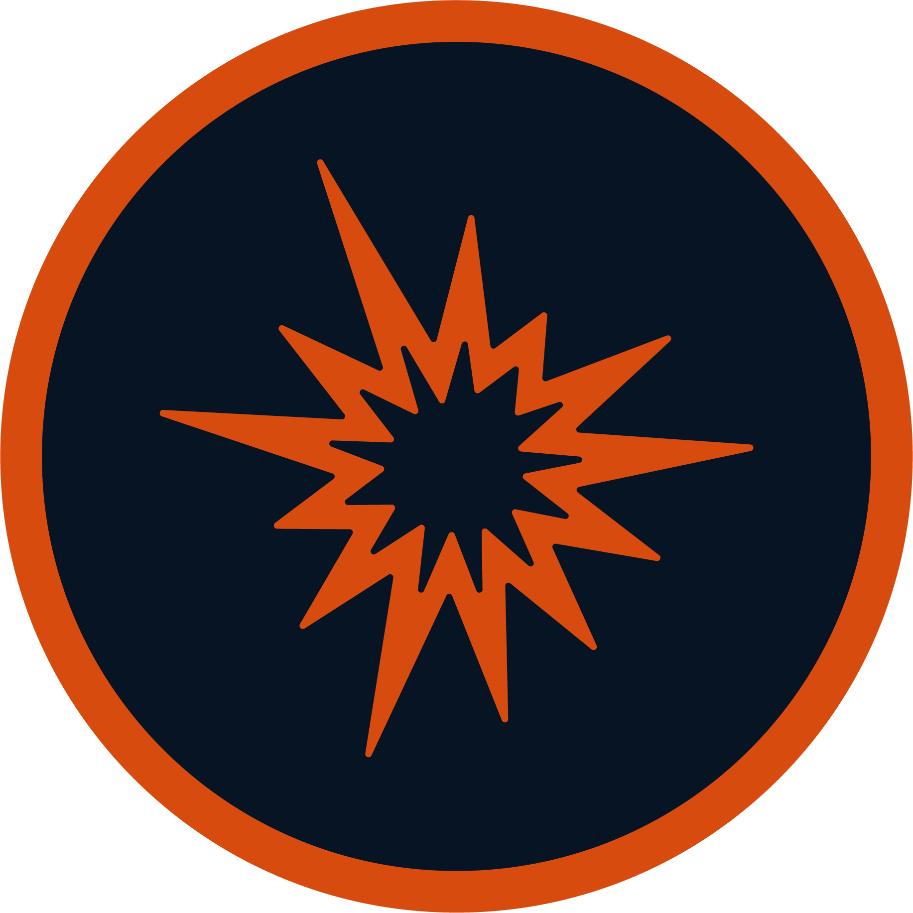
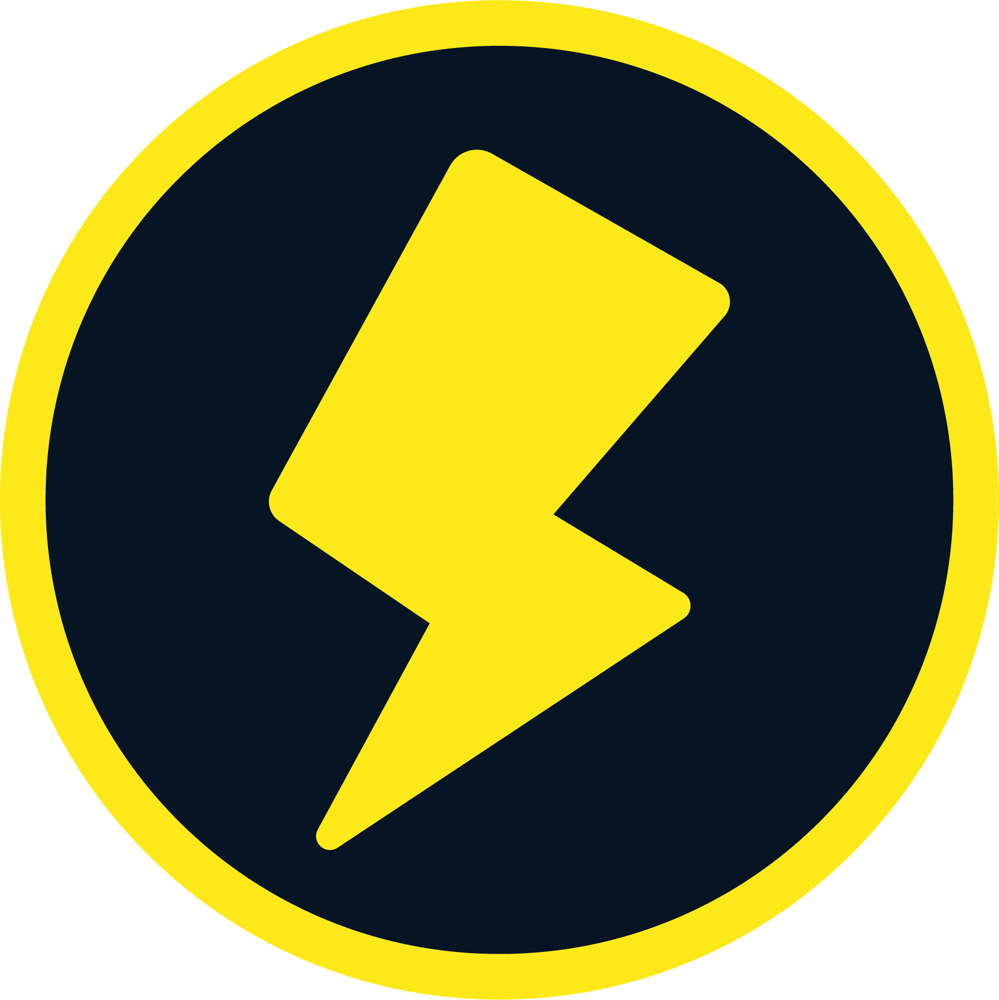

# Elements in Detail
{: .no_toc }

  

    Table of contents
  

  {: .text-delta }
- TOC
{:toc}

The Elements that your attack can be don't have a full on out description of what they are in the Paper Story Rulebook, since they can technically be anything. 

If you really wanted Element (Clown), your Gamemaster can allow it if they wish. Here I have taken the liberty to list out the most common Elements you will find in Paper Story, along with their most common Weaknesses, and even descriptions of each Element.

{: .content-callout }
> 
> {: .float-right }
> ## Fire
> 
> {: .content-callout }
> > *Suggested Weakness*{: .header-font .fs-5 }
> >
> > {: .inline-icon } Water, {: .inline-icon } Ice
>
> Heat, flames, and burns. The fiery breath of a Dragon or the flickering open campfire.
>
> *Ie, Hooktail's Fire Breath, the touch of a Lava Bubble, Fire Flowers*{: .mgl .fs-3 .italic }
>

{: .content-callout }
> 
> {: .float-right }
> ## Ice
> 
> {: .content-callout }
> > *Suggested Weakness*{: .header-font .fs-5 }
> >
> > {: .inline-icon } Blast, {: .inline-icon } Fire
>
> Cold, frost, and frozen things. The chill of the air or the touch of an icicle on bare skin.
>
> *Ie, Frost Piranha's Icy Breath, the touch of a Li'l Brr, Ice Flowers*{: .mgl .fs-3 .italic }
>

{: .content-callout }
> 
> {: .float-right }
> ## Shock
> 
> {: .content-callout }
> > *Suggested Weakness*{: .header-font .fs-5 }
> >
> > {: .inline-icon } Earth, {: .inline-icon } Goop
>
> Electrical currents and bolts of lightning from the sky. Static shock and all types of plasma.
>
> *Ie, Watt's Electro Dash, the touch of an Amp, the Thunder Bolt item*{: .mgl .fs-3 .italic }
>

{: .content-callout }
> 
> {: .float-right }
> ## Water
>
> {: .content-callout }
> > *Suggested Weakness*{: .header-font .fs-5 }
> >
> > {: .inline-icon } Poison, {: .inline-icon } Shock
>
> Jets of water and other liquids, floods, and potentially even drowning. The powers of the ocean.
>
> *Ie, Sushie's Squirt or Tidal Wave*{: .mgl .fs-3 .italic }
>

{: .content-callout }
> 
> {: .float-right }
> ## Air
> 
> {: .content-callout }
> > *Suggested Weakness*{: .header-font .fs-5 }
> >
> > {: .inline-icon } Poison, {: .inline-icon } Shock
>
> Gusts of wind with enough force to feel like a punch. The power of the sky.
>
> *Ie, Parakarry's Air Raid, Buzzar's Wind Blast*{: .mgl .fs-3 .italic }
>

{: .content-callout }
> 
> {: .float-right }
> ## Blast
> 
> {: .content-callout }
> > *Suggested Weakness*{: .header-font .fs-5 }
> >
> > {: .inline-icon } Fire, {: .inline-icon } Goop
>
> Explosions and high amounts of force. Bombs going off or the force of a missile.
>
> *Ie, a Bomb-Omb's explosion, the Egg Bomb item, being hit by a Bullet Bill*{: .mgl .fs-3 .italic }
>

{: .content-callout }
> 
> {: .float-right }
> ## Earth
> 
> {: .content-callout }
> > *Suggested Weakness*{: .header-font .fs-5 }
> >
> > {: .inline-icon } Air, {: .inline-icon } Blast
>
> Rocks, mountains, and earthquakes. The power of nature and magical stones
>
> *Ie, Monty Mole's Rock Toss, the Earth Quake item, Earth Tremor*{: .mgl .fs-3 .italic }
>

{: .content-callout }
> 
> {: .float-right }
> ## Goop
>
> {: .content-callout }
> > *Suggested Weakness*{: .header-font .fs-5 }
> >
> > {: .inline-icon } Air, {: .inline-icon } Water
>
> Acidic ooze and black paint. Stuff that corrodes and eats away at stuff. 
>
> *Ie, Shadow Mario's Paint, the Ooze fired by some Rabbid Weapons*{: .mgl .fs-3 .italic }
>

{: .content-callout }
> 
> {: .float-right }
> ## Poison
>
> {: .content-callout }
> > *Suggested Weakness*{: .header-font .fs-5 }
> >
> > {: .inline-icon } Earth, {: .inline-icon } Ice
>
> Venomous stings and toxic gasses. Stuff that pollutes and makes you sick.
>
> *Ie, Gloomtail's Poison Breath, the touch of a Poison Mushroom, a Poison Pokey's sting*{: .mgl .fs-3 .italic }
>

{: .content-callout }
> 
> {: .float-right }
> ## Light
>
> {: .content-callout }
> > *Suggested Weakness*{: .header-font .fs-5 }
> >
> > {: .inline-icon } Shadow, {: .inline-icon } Star
>
> Light, holy, and radiant energies. The energies of the Nimbi and the Star Spirits
>
> *Ie, the light of a Lantern Ghost's Lantern*{: .mgl .fs-3 .italic }
>

{: .content-callout }
> 
> {: .float-right }
> ## Shadow
>
> {: .content-callout }
> > *Suggested Weakness*{: .header-font .fs-5 }
> >
> > {: .inline-icon } Light, {: .inline-icon } Star
>
> Darkness, shadows, and necrotic energies. The touch of the undead and the energy of the Ztars.
>
> *Ie, Shadow Queen's Dark Wave*{: .mgl .fs-3 .italic }
>

{: .content-callout }
> 
> {: .float-right }
> ## Star
>
> {: .content-callout }
> > *Suggested Weakness*{: .header-font .fs-5 }
> >
> > {: .inline-icon } Light, {: .inline-icon } Shadow
>
> Untyped cosmic energy. Similar in nature to D&D's Force Damage.
>
> *Ie, Monstar's Magic Storm, the Shooting Star item, Star Storm, Supernova*{: .mgl .fs-3 .italic }
>