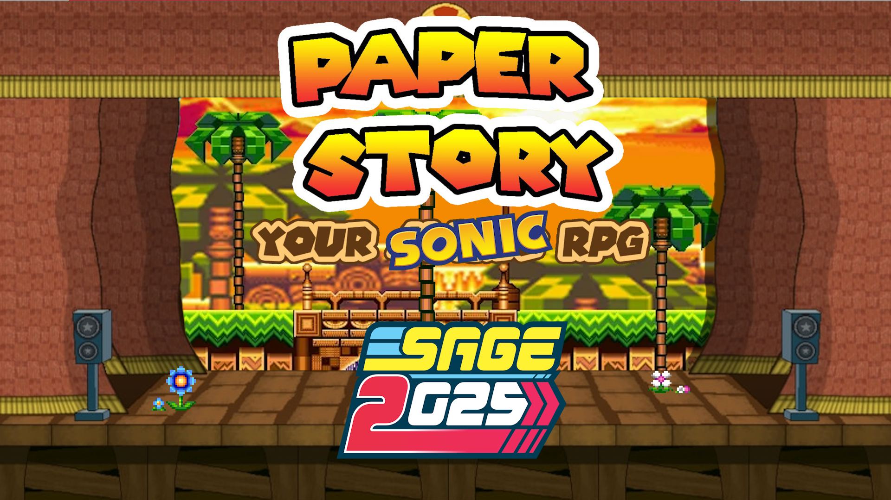
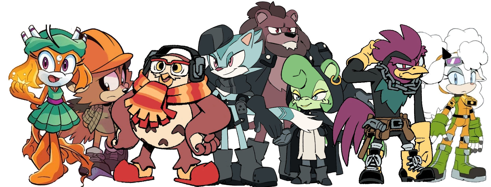

# Paper Story @SAGE2025
{: .no_toc }

{: .center-img }

  

    Table of contents
  

  {: .text-delta }
- TOC
{:toc}

As a way to celebrate trying to get Paper Story a booth for SAGE2025, the community has come together to create a small collection of Sonic-themed homebrew content for the game, including Species, new expanded Rules, and more!

While this content is not official, Deuce himself participated in a good chunk of it, and we can proudly present it to you all!

# Species

As a way to encompass the wide variety of characters seen in the Sonic franchise, and offer a good framework for players to create OCs that fit the Sonic-style, we decided to create a unique "Mobian" species, with a number of options to customise them to your liking.

{: .specie-callout }
> ## Mobian
>
> {: .center-img }
>
> Mobians are the most common inhabitants of Sonic's World, anthropomorphic animals with a variety of appearances and abilities. While most Mobians take from real-world mammals, they can also include birds, reptiles, and even aquatic creatures.  
> While not all Mobians are fighters by trade, their culture has for long been deeply intertwined with conflicts on a global scale, leading to a strong warrior ethos among many, and the courage to stand up against oppression.
>
> *+1 Any Stat, **+1 Courage**{: .courage-color }*{: .text-gamma .header-font }  
> *1 Power, 0 Defense*{: .text-gamma .header-font }  
>
> At character creation, define the Mobian's specific animal type, as it will help determine their abilities and traits.
>
> {: .specie-pros-callout }
> > *Pros*{: .text-gamma .header-font }  
> > *+ Athletics (Any)*{: .heart-color }  
> > *Must be chosen at character creation. Examples include Brawn, Jump, Run...*{: .mgl .fs-3 }  
> > *+ Notice (Details)*{: .spirit-color }  
> > *or **+ Notice (Distant Vision)**{: .spirit-color }*{: .mgl }  
> > *or **+ Notice (Listen)**{: .spirit-color }*{: .mgl }  
> > *or **+ Notice (Scent)**{: .spirit-color }*{: .mgl }  
> > *+ Steady (VS Fear)*{: .courage-color }  
> > *Up to 2 of the following:*{: .underlined }  
> > *1 Resist (Element)*{: .mgl }  
> > *This Element must be specified during character creation. This can be chosen twice with either the same or a different element.*{: .mgl-big .fs-3 }  
> > *Adapted (Any), Carrier, Fly, Hover or Resilient*{: .mgl }  
> > *Depending on what could makes sense for your character species.*{: .mgl-big .fs-3 }  
> > *The type of Adapted must be specified during character creation.*{: .mgl-big .fs-3 }
>
> {: .specie-cons-callout }
> > *Cons*{: .text-gamma .header-font }  
> > Sinker  
> > *Unless the character has either Adapted (to some Water environment) or Fly.*{: .mgl .fs-3 }  
> > *Up to 2 of the following, and at least as much as you took Pros:*{: .underlined }  
> > Weakness (Confuse, Provoke)  
> > *The Level and Duration of any of these Statuses inflicted on you is doubled.*{: .mgl .fs-3 }  
> > Weakness (Noise)  
> > *The Level and Duration of all Statuses you suffer from sound-based sources is doubled.*{: .mgl .fs-3 }  
> > Weakness (Scent)  
> > *The Level and Duration of all Statuses you suffer from scent-based sources is doubled.*{: .mgl .fs-3 }  
>
> {: .specie-inner-callout }
> > *Tech Defaults*{: .text-gamma .header-font }  
> >
> > Aerial  
> > *Tool*{: .alt-grey-line }  
> > Variant (*Athletics*{: .heart-color })  
> > *+1 Custom Set*{: .alt-grey-line }  
> >
> > Custom Sets are customisable Tech Defaults defined during character creation.  
> > For Mobians, they can include any Traits totalling no more than *2 FP*{: .spirit-color }, but can't include negative Traits.
>
> {: .specie-inverted-callout }
> > *Example Techniques*{: .text-gamma .header-font .text-grey-lt-000 }  
> >
> > {: .specie-inner-callout }  
> > > *Weapon Strike*{: .header-font } (**0 FP**{: .spirit-color })  
> > > Attacks with a hand-held weapon.  
> > > *Coordination*{: .heart-color }: (Primary Check)  
> > > Auto: 1 DMG  
> > > *Nice!*{: .nice-color }: 2 DMG  
> > > *Tool (Indirect)*{: .italic .fs-3 }
> > >
> >
> > {: .specie-inner-callout }  
> > > *Dust Up*{: .header-font } (**1 FP**{: .spirit-color })  
> > > (Using Disorient as a Custom Set Tech Default)  
> > > Kicks sand in the enemy's face with speed and force, temporarily blinding them!  
> > > *Athletics*{: .heart-color }: (Secondary Check)  
> > > *Nice!*{: .nice-color }: Disorients (1) for 4 turns.  
> > > *Good!*{: .good-color }: Disorients (2) for 4 turns.  
> > > *Great!*{: .great-color }: Disorients (3) for 4 turns.  
> > > *Wonderful!*{: .wonderful-color }: Disorients (4) for 4 turns.  
> > > *Disorient x4, Harmless (Indirect), Situational (Hindered: Without soil, sand, etc.)*{: .italic .fs-3 }
> > >
> >
>

# Subspecies

Subspecies are means to further customise a character. A bunch of them are already available in the core rulebook, but we thought that Sonic deserved some unique ones around a specific theme.. Here comes Speed-Type-, Power-Type- and Fly-Type- Subspecies!

{: .subspecie-callout }
> ## Speed-Type- 
> {: .no_toc }
>
> 
> {: .float-right-desktop }
> Speed-Type creatures have an affinity for speed that they can't control; in all avenues of life, they've just *got*{: .underlined } to go fast, no matter the cost.
>
> *e.g. Sonic; Espio*{: .italic }
>
> *[Type]*{: .header-font }
>
> ***+1 Spirit**{: .spirit-color }, **-1 Courage**{: .courage-color }*{: .text-gamma .header-font }  
>
> {: .specie-inner-callout }
> > *Add*{: .text-gamma .header-font }  
> > *+ Athletics (Run)*{: .heart-color }  
> > *+ Trickery (Dodge)*{: .spirit-color }  
> > *+ Steady (Balance)*{: .courage-color }  
> > Defense is reduced by 1  
> > *It also caps at 1 maximum.*{: .mgl .fs-3 }  
> > Hover  
> > *If Fly is removed from the base species only.*{: .mgl .fs-3 }  
> > Devotion (to Speed)  
> > *You cannot willingly use the Delayed Technique Traits in your Innate Techniques.*{: .mgl .fs-3 }
> >
>
> {: .specie-inner-callout }
> > *Remove*{: .text-gamma .header-font }  
<!-- > > Specializations in *Guard*{: .heart-color }, *Crafts*{: .spirit-color }, *Notice*{: .spirit-color }; Remove any remaining specializations from the final species until you have at most 3.   -->
> > Fly  
> > Weakness (Air)
> >
>
> {: .specie-inner-callout }
> > *Added Tech Defaults*{: .text-gamma .header-font }  
> >
> > Boost (*Athletics*{: .heart-color })  
> > *Disorient*{: .alt-grey-line }  
> > Hustle  
> > *+ **Required**{: .underlined }: When Hustle is added as a Tech Default, add either Self or Split. Only the user can be targeted with Hustle.*{: .mgl .fs-3 }
> > *Overrun*{: .alt-grey-line }  
> > Swap x2
> >
>
<!-- > {: .specie-inner-callout }
> > *Removed Tech Defaults*{: .text-gamma .header-font }  
> >
> > Lengthen  
> > *Lingering*{: .alt-grey-line }  
> > *Spillover*{: .italic }  
> > *Throw*{: .italic .alt-grey-line }  
> > -->
>
> {: .specie-inner-callout }
> > *Conditions*{: .text-gamma .header-font }  
> >
> > Can't be combined with another [Type] subspecies.
> >
>

{: .subspecie-callout }
> ## Power-Type- 
> {: .no_toc }
>
> 
> {: .float-right-desktop }
> Power-Type creatures are rougher than the rest of them, even the best of them; they're much stronger than they appear and are *not*{: .underlined } to be messed with.
>
> *e.g. Knuckles; Vector*{: .italic }
>
> *[Type]*{: .header-font }
>
> *-1 Spirit*{: .text-gamma .header-font .spirit-color }  
> *+1 Power*{: .text-gamma .header-font }  
>
> {: .specie-inner-callout }
> > *Add*{: .text-gamma .header-font }  
> > *+ Athletics (Brawn)*{: .heart-color }  
> > *or **+ Bully (Brawn)**{: .courage-color }*{: .mgl }  
> > *+ Coordination (Brawl)*{: .heart-color }  
> > *+ Steady (Poise)*{: .courage-color }  
> > Carrier  
> > Hover  
> > *If Fly is removed from the base species only.*{: .mgl .fs-3 }
> >
>
> {: .specie-inner-callout }
> > *Remove*{: .text-gamma .header-font }  
<!-- > > Specializations in *Heal*{: .heart-color }, *Trickery*{: .spirit-color }, *Persuade*{: .courage-color }; Remove any remaining specializations from the final species until you have at most 3.   -->
> > Fly  
> > Weakness (Air, Earth, Crushing)
> >
>
> {: .specie-inner-callout }
> > *Added Tech Defaults*{: .text-gamma .header-font }  
> >
> > Launch  
> > *Quake*{: .alt-grey-line }  
> > Throw  
> > *Underfoot*{: .alt-grey-line }  
> > Weaken (Defense)
> >
<!-- >
> {: .specie-inner-callout }
> > *Removed Tech Defaults*{: .text-gamma .header-font }  
> >
> > *Hearty*{: .italic }  
> > *Flowery*{: .italic .alt-grey-line }  
> > *Tutor*{: .italic }  
> > *Ranged*{: .italic .alt-grey-line }  
> > -->
>
> {: .specie-inner-callout }
> > *Conditions*{: .text-gamma .header-font }  
> >
> > Can't be combined with another [Type] subspecies.
> >
>

{: .subspecie-callout }
> ## Subspecies- 
> {: .no_toc }
>
> 
> {: .float-right-desktop }
> Fly-Type creatures have conquered the skies, and are at home in the air. They can be a bit fragile on the ground, but they make up for it with their aerial prowess.
>
> *e.g. Tails; Rouge*{: .italic }
>
> ***-1 Heart**{: .heart-color }, **+1 Spirit**{: .spirit-color }*{: .text-gamma .header-font }  
>
> {: .specie-inner-callout }
> > *Add*{: .text-gamma .header-font }  
> > *+ Aim (Bombard)*{: .heart-color }  
> > *+ Athletics (Fly)*{: .heart-color }  
> > *+ Trickery (Dodge)*{: .spirit-color }  
> > *+ Steady (Turbulance)*{: .courage-color }  
> > Carrier  
> > Hover  
> > 
>
> {: .specie-inner-callout }
> > *Remove*{: .text-gamma .header-font }  
<!-- > > Specializations in *Athletics*{: .heart-color } (It keeps its new *Athletics (Fly)*{: .heart-color }), *Magic*{: .spirit-color }, *Bully*{: .courage-color }; Remove any remaining specializations from the final species until you have at most 3.   -->
> > Weakness (Air)  
> > 
>
> {: .specie-inner-callout }
> > *Added Tech Defaults*{: .text-gamma .header-font }  
> >
> > Aerial  
> > *Bestow (Fly)*{: .alt-grey-line }  
> > Ranged  
> > *Secure (High Flying)*{: .alt-grey-line }  
> >
<!-- >
> {: .specie-inner-callout }
> > *Removed Tech Defaults*{: .text-gamma .header-font }  
> >
> > *Quake*{: .italic }  
> > *Underfoot*{: .italic .alt-grey-line }  
> > *Counter*{: .italic }  
> > *Fear*{: .italic .alt-grey-line }  
> > -->
>
> {: .specie-inner-callout }
> > *Conditions*{: .text-gamma .header-font }  
> >
> > Can't be combined with another [Type] subspecies.  
> > Final species must have Fly, Efficient (Flight) or *+ Magic (Flight)*{: .spirit-color }.
> >
>

{: .tip-callout }
> *You can always combine multiple Subspecies as long as you fit all the conditions to apply them, and the character's final Stats aren't reduced below 0. My Metal Sonic is a great example of this! He's a Speed-Type-, Metal- Mobian!*
> {: .icon-right }

{: .tip-callout }
> *It can even make a big difference. Metal's sibling, Mecha Sonic Mark II is a Power-Type-, Mecha- Mobian. I even gave him a Specialization in GUNS!*
> {: .icon-right }