# Paper Story @SAGE2025
{: .no_toc }

{: .center-img }

  

    Table of contents
  

  {: .text-delta }
- TOC
{:toc}

As a way to celebrate trying to get Paper Story a booth for SAGE2025, the community has come together to create a small collection of Sonic-themed homebrew content for the game, including Species, new expanded Rules, and more!

While this content is not official, Deuce himself participated in a good chunk of it, and we can proudly present it to you all!

# Species

As a way to encompass the wide variety of characters seen in the Sonic franchise, and offer a good framework for players to create OCs that fit the Sonic-style, we decided to create a unique "Mobian" species, with a number of options to customise them to your liking.

{: .specie-callout }
> ## Mobian
>
> {: .center-img }
>
> Mobians are the most common inhabitants of Sonic's World, anthropomorphic animals with a variety of appearances and abilities. While most Mobians take from real-world mammals, they can also include birds, reptiles, and even aquatic creatures.  
> While not all Mobians are fighters by trade, their culture has for long been deeply intertwined with conflicts on a global scale, leading to a strong warrior ethos among many, and the courage to stand up against oppression.
>
> *+1 Any Stat, **+1 Courage**{: .courage-color }*{: .text-gamma .header-font }  
> *1 Power, 0 Defense*{: .text-gamma .header-font }  
>
> At character creation, define the Mobian's specific animal type, as it will help determine their abilities and traits.
>
> {: .specie-pros-callout }
> > *Pros*{: .text-gamma .header-font }  
> > *+ Athletics (Any)*{: .heart-color }  
> > *Must be chosen at character creation. Examples include Brawn, Jump, Run...*{: .mgl .fs-3 }  
> > *+ Notice (Details)*{: .spirit-color }  
> > *or **+ Notice (Distant Vision)**{: .spirit-color }*{: .mgl }  
> > *or **+ Notice (Listen)**{: .spirit-color }*{: .mgl }  
> > *or **+ Notice (Scent)**{: .spirit-color }*{: .mgl }  
> > *+ Steady (VS Fear)*{: .courage-color }  
> > *Up to 2 of the following:*{: .underlined }  
> > *1 Resist (Element)*{: .mgl }  
> > *This Element must be specified during character creation. This can be chosen twice with either the same or a different element.*{: .mgl-big .fs-3 }  
> > *Adapted (Any), Carrier, Fly, Hover or Resilient*{: .mgl }  
> > *Depending on what could makes sense for your character species.*{: .mgl-big .fs-3 }  
> > *The type of Adapted must be specified during character creation.*{: .mgl-big .fs-3 }
>
> {: .specie-cons-callout }
> > *Cons*{: .text-gamma .header-font }  
> > Sinker  
> > *Unless the character has either Adapted (to some Water environment) or Fly.*{: .mgl .fs-3 }  
> > *Up to 2 of the following, and at least as much as you took Pros:*{: .underlined }  
> > Weakness (Confuse, Provoke)  
> > *The Level and Duration of any of these Statuses inflicted on you is doubled.*{: .mgl .fs-3 }  
> > Weakness (Noise)  
> > *The Level and Duration of all Statuses you suffer from sound-based sources is doubled.*{: .mgl .fs-3 }  
> > Weakness (Scent)  
> > *The Level and Duration of all Statuses you suffer from scent-based sources is doubled.*{: .mgl .fs-3 }  
>
> {: .specie-inner-callout }
> > *Tech Defaults*{: .text-gamma .header-font }  
> >
> > Aerial  
> > *Tool*{: .alt-grey-line }  
> > Variant (*Athletics*{: .heart-color })  
> > *+1 Custom Set*{: .alt-grey-line }  
> >
> > Custom Sets are customisable Tech Defaults defined during character creation.  
> > For Mobians, they can include any Traits totalling no more than *2 FP*{: .spirit-color }, but can't include negative Traits.
>
> {: .specie-inverted-callout }
> > *Example Techniques*{: .text-gamma .header-font .text-grey-lt-000 }  
> >
> > {: .specie-inner-callout }  
> > > *Weapon Strike*{: .header-font } (**0 FP**{: .spirit-color })  
> > > Attacks with a hand-held weapon.  
> > > *Coordination*{: .heart-color }: (Primary Check)  
> > > Auto: 1 DMG  
> > > *Nice!*{: .nice-color }: 2 DMG  
> > > *Tool (Indirect)*{: .italic .fs-3 }
> > >
> >
> > {: .specie-inner-callout }  
> > > *Dust Up*{: .header-font } (**2 FP**{: .spirit-color })  
> > > (Using Disorient as a Custom Set Tech Default)  
> > > Kicks sand in the enemy's face with speed and force, temporarily blinding them!  
> > > *Athletics*{: .heart-color }: (Secondary Check)  
> > > *Nice!*{: .nice-color }: Disorients (1) for 4 turns.  
> > > *Good!*{: .good-color }: Disorients (2) for 4 turns.  
> > > *Great!*{: .great-color }: Disorients (3) for 4 turns.  
> > > *Wonderful!*{: .wonderful-color }: Disorients (4) for 4 turns.  
> > > *Variant (**Athletics**{: .heart-color }), Disorient x4, Harmless (Indirect), Situational (Common: Unusable without soil, sand, etc.)*{: .italic .fs-3 }
> > >
> >
>

# Subspecies

Subspecies are means to further customise a character. A bunch of them are already available in the core rulebook, but we thought that Sonic deserved some unique ones around a specific theme.. Here comes Speed-Type-, Power-Type- and Fly-Type- Subspecies!

{: .subspecie-callout }
> ## Speed-Type- 
>
> 
> {: .float-right-desktop }
> Speed-Type creatures have an affinity for speed that they can't control; in all avenues of life, they've just *got*{: .underlined } to go fast, no matter the cost.
>
> *e.g. Sonic; Espio*{: .italic }
>
> *[Type]*{: .header-font }
>
> ***+1 Spirit**{: .spirit-color }, **-1 Courage**{: .courage-color }*{: .text-gamma .header-font }  
>
> {: .specie-inner-callout }
> > *Add*{: .text-gamma .header-font }  
> > *+ Athletics (Run)*{: .heart-color }  
> > *+ Trickery (Dodge)*{: .spirit-color }  
> > *+ Steady (Balance)*{: .courage-color }  
> > Defense is reduced by 1  
> > *It also caps at 1 maximum.*{: .mgl .fs-3 }  
> > Hover  
> > *If Fly is removed from the base species only.*{: .mgl .fs-3 }  
> > Devotion (to Speed)  
> > *You cannot willingly use the Delayed Technique Traits in your Innate Techniques.*{: .mgl .fs-3 }
> >
>
> {: .specie-inner-callout }
> > *Remove*{: .text-gamma .header-font }  
> > Fly  
> > Weakness (Air)
> >
>
> {: .specie-inner-callout }
> > *Added Tech Defaults*{: .text-gamma .header-font }  
> >
> > Boost (*Athletics*{: .heart-color })  
> > *Disorient*{: .alt-grey-line }  
> > Hustle  
> > *+ **Required**{: .underlined }: When Hustle is added as a Tech Default, add either Self or Split. Only the user can be targeted with Hustle.*{: .mgl .fs-3 }  
> > *Overrun*{: .alt-grey-line }  
> > Swap x2
> >
>
>
> {: .specie-inner-callout }
> > *Conditions*{: .text-gamma .header-font }  
> >
> > Can't be combined with another [Type] subspecies.
> >
>

{: .subspecie-callout }
> ## Power-Type- 
>
> 
> {: .float-right-desktop }
> Power-Type creatures are rougher than the rest of them, even the best of them; they're much stronger than they appear and are *not*{: .underlined } to be messed with.
>
> *e.g. Knuckles; Vector*{: .italic }
>
> *[Type]*{: .header-font }
>
> *-1 Spirit*{: .text-gamma .header-font .spirit-color }  
> *+1 Power*{: .text-gamma .header-font }  
>
> {: .specie-inner-callout }
> > *Add*{: .text-gamma .header-font }  
> > *+ Athletics (Brawn)*{: .heart-color }  
> > *or **+ Bully (Brawn)**{: .courage-color }*{: .mgl }  
> > *+ Coordination (Brawl)*{: .heart-color }  
> > *+ Steady (Poise)*{: .courage-color }  
> > Carrier  
> > Hover  
> > *If Fly is removed from the base species only.*{: .mgl .fs-3 }
> >
>
> {: .specie-inner-callout }
> > *Remove*{: .text-gamma .header-font }  
> > Fly  
> > Weakness (Air, Earth, Crushing)
> >
>
> {: .specie-inner-callout }
> > *Added Tech Defaults*{: .text-gamma .header-font }  
> >
> > Launch  
> > *Quake*{: .alt-grey-line }  
> > Throw  
> > *Underfoot*{: .alt-grey-line }  
> > Weaken (Defense)
> >
>
> {: .specie-inner-callout }
> > *Conditions*{: .text-gamma .header-font }  
> >
> > Can't be combined with another [Type] subspecies.
> >
>

{: .subspecie-callout }
> ## Fly-Type- 
>
> 
> {: .float-right-desktop }
> Fly-Type creatures have conquered the skies, and are at home in the air. They can be a bit fragile on the ground, but they make up for it with their aerial prowess.
>
> *e.g. Tails; Rouge*{: .italic }
>
> ***-1 Heart**{: .heart-color }, **+1 Spirit**{: .spirit-color }*{: .text-gamma .header-font }  
>
> *[Type]*{: .header-font }
>
> {: .specie-inner-callout }
> > *Add*{: .text-gamma .header-font }  
> > *+ Aim (Bombard)*{: .heart-color }  
> > *+ Athletics (Fly)*{: .heart-color }  
> > *+ Trickery (Dodge)*{: .spirit-color }  
> > *+ Steady (Turbulance)*{: .courage-color }  
> > Carrier  
> > Hover  
> > 
>
> {: .specie-inner-callout }
> > *Remove*{: .text-gamma .header-font }  
> > Weakness (Air)  
> > 
>
> {: .specie-inner-callout }
> > *Added Tech Defaults*{: .text-gamma .header-font }  
> >
> > Aerial  
> > *Bestow (Fly)*{: .alt-grey-line }  
> > Ranged  
> > *Secure (High Flying)*{: .alt-grey-line }  
> >
>
> {: .specie-inner-callout }
> > *Conditions*{: .text-gamma .header-font }  
> >
> > Can't be combined with another [Type] subspecies.  
> > Final species must have Fly, Efficient (Flight) or *+ Magic (Flight)*{: .spirit-color }.
> >
>

{: .tip-callout }
> *You can always combine multiple Subspecies as long as you fit all the conditions to apply them, and the character's final Stats aren't reduced below 0. My Metal Sonic is a great example of this! He's a Speed-Type-, Metal- Mobian!*
> {: .icon-right }

{: .tip-callout }
> *It can even make a big difference. Metal's sibling, Mecha Sonic Mark II is a Power-Type-, Mecha- Mobian. I even gave him a Specialization in GUNS!*
> {: .icon-right }

# Example Characters

Here are some example characters made using the Mobian species and Subspecies! They're made as Level 1 characters, and hopefully can inspire you.

Most of them also come as Google Sheets versions, so you can more easily copy them if you intend to use them.  

{: .specie-callout }
> ## Sonic the Hedgehog
>
> 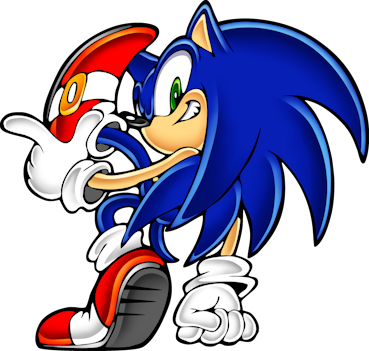
> {: .float-right-desktop }
>
> Character by *@plusdeuce*{: .italic .courage-color }  
> [Google Sheets](https://docs.google.com/spreadsheets/d/1pkcVloC4kosJX8GaTh2ip3Djh6Q45kxh1xBeqXZ9pQU)
>
> {: .specie-inner-callout }
> > *HP: 10 / 10*{: .text-gamma .header-font .heart-color }  
> > *FP: 15 / 15*{: .text-gamma .header-font .spirit-color }  
> > *BP: 2 / 3*{: .text-gamma .header-font .courage-color }  
> > *SP: 10 / 10*{: .text-gamma .header-font .sp-color }  
> > *Level: 1*{: .text-gamma .header-font .level-color }  
>
> {: .specie-inner-callout }
> > *Heart: 2*{: .text-gamma .header-font .heart-color }  
> > *Spirit: 3*{: .text-gamma .header-font .spirit-color }  
> > *Courage: 1*{: .text-gamma .header-font .courage-color }  
> > *Power: 1*{: .text-gamma .header-font }  
> > *Defense: 0*{: .text-gamma .header-font }  
>
> *Mobian (Speed-Type)*{: .text-gamma .header-font }, Blue  
>
> {: .character-heart-callout }
> > *Aim: 0*{: .heart-color }  
> > *Athletics: 4 (+Run, +Spin)*{: .heart-color }  
> > *Coordination: 0*{: .heart-color }  
> > *Guard: 0*{: .heart-color }  
> > *Heal: 0*{: .heart-color }
>
> {: .character-spirit-callout }
> > *Crafts: 0*{: .spirit-color }  
> > *Knowhow: 0*{: .spirit-color }  
> > *Magic: 0*{: .spirit-color }  
> > *Notice: 1 (+Shortcuts)*{: .spirit-color }  
> > *Trickery: 2 (+Dodge)*{: .spirit-color }  
>
> {: .character-courage-callout }
> > *Bully: 0*{: .courage-color }  
> > *Cheer: 0*{: .courage-color }  
> > *Perform: 1 (+Stylish Moves)*{: .courage-color }  
> > *Persuade: 0*{: .courage-color }  
> > *Steady: 1 (+VS Fear, +Balance)*{: .courage-color }
>
> {: .specie-inner-callout }
> > Resilient  
> > *You can recover from KO with a **Nice**{: .nice-color } **Steady**{:courage-color } check, reviving back up to **5 HP**{: .heart-color }.*{: .mgl .fs-3 }  
> > *An extra Grade allows you to act immediately!*{: .mgl .fs-3 }  
> > *Required Grades incrase by 1 for each Resilient check made during an encounter.*{: .mgl .fs-3 }  
> > Weakness (Scent)  
> > *The Level and Duration of all scent-based Statuses inflicted on you is doubled.*{: .mgl .fs-3 }  
> > Sinker  
> > *Can't swim.*{: .mgl .fs-3 }  
> > Devotion (to Speed)  
> > *You cannot willingly use the Delayed Technique Traits in your Innate Techniques.*{: .mgl .fs-3 }  
>
> {: .specie-inner-callout }
> > *Tech Defaults*{: .text-gamma .header-font }  
> >
> > Boost (*Athletics*{: .heart-color })  
> > *Aerial*{: .alt-grey-line }  
> > Disorient  
> > *Overrun*{: .alt-grey-line }  
>
> {: .specie-inverted-callout }
> > *Innate Techniques*{: .text-gamma .header-font .text-grey-lt-000 }  
> >
> > {: .specie-inner-callout }  
> > > *Spin Jump*{: .header-font } (**0 FP**{: .spirit-color })  
> > > Leaps through the air with blinding speed, homing in and piercing through enemy defenses!  
> > > 
> > > While hurtling through a Gale, this attack gains the Air element.  
> > > Under the effects of Sonic's own slipstream, this results in a bonus +2 Attack!  
> > >
> > > *Athletics (+Spin)*{: .heart-color }:  
> > > *Good!*{: .good-color }: 1 Homing Piercing DMG  
> > > *Great!*{: .great-color }: 2 Homing Piercing DMG  
> > > *Aerial, Homing, Piercing, Unwieldy x2*{: .italic .fs-3 }  
> > > *+ Conditional (Must be in Gale Terrain): Element (Air)*{: .mgl .italic .fs-3 }
> > >
> >
> > {: .specie-inner-callout }  
> > > *Rushing the Slipstream*{: .header-font } (**5 FP**{: .spirit-color })  
> > > Boosts through the enemy at mach speed, leaving a slipstream in his wake!  
> > > 
> > > This causes a Gale Terrain to form around Sonic and all grounded foes in the enemy group.  
> > > It may also leave the enemy Disoriented.  
> > >
> > > *Athletics (+Run)*{: .heart-color }:  
> > > *Good!*{: .good-color }: 2 DMG  
> > > *Trickery*{: .spirit-color }:  
> > > *Good!*{: .good-color }: Gale Terrain (2) for 3 rounds, Disorient (1) for 2 turns.  
> > > *Overrun, Disorient, Lengthen, Shared, Terrain (Gale) x2, Variant (**Athletics**{: .heart-color }), Commitment (Primary, Secondary), Unwieldy*{: .italic .fs-3 }
> > >
> >
>
> {: .specie-inverted-callout }
> > *Badges*{: .text-gamma .header-font .text-grey-lt-000 }
> >
> > {: .specie-inner-callout .item-left }
> > > 
> > >
> > > {: .item-inner-callout }
> > > > *Timing Tutor*{: .fs-6 .header-font }  
> > > > *Badge*{: .label .item .header-font }*Skills*{: .label .skills-badge .header-font }  
> > > > {: .inline-icon } • 1 BP
> > > >
> > > > Adds +1d6 to *Stylish Moves*{: .courage-color } checks.
> > >
> > 
>

{: .tip-callout }
> *I'm Sonic! Sonic the Hedgehog!  
> I'm in a strange new place with all sorts of weird creatures. No doubt about it, Eggman's behind this!  
> I'd better track him down, and fast!*
> {: .icon-right }

--- 
{: .species-separator }

{: .specie-callout }
> ## Tails "Miles" Prower
>
> 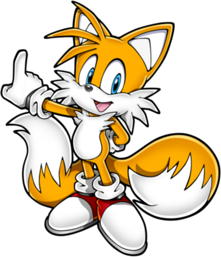
> {: .float-right-desktop }
>
> Character by *@piyohthegenius*{: .italic .courage-color }  
>
> {: .specie-inner-callout }
> > *HP: 5 / 5*{: .text-gamma .header-font .heart-color }  
> > *FP: 15 / 15*{: .text-gamma .header-font .spirit-color }  
> > *BP: 6 / 6*{: .text-gamma .header-font .courage-color }  
> > *SP: 10 / 10*{: .text-gamma .header-font .sp-color }  
> > *Level: 1*{: .text-gamma .header-font .level-color }  
>
> {: .specie-inner-callout }
> > *Heart: 1*{: .text-gamma .header-font .heart-color }  
> > *Spirit: 3*{: .text-gamma .header-font .spirit-color }  
> > *Courage: 2*{: .text-gamma .header-font .courage-color }  
> > *Power: 1*{: .text-gamma .header-font }  
> > *Defense: 0*{: .text-gamma .header-font }  
>
> *Mobian (Fly-Type)*{: .text-gamma .header-font }, Yellow  
>
> {: .character-heart-callout }
> > *Aim: 2 (+Bombard)*{: .heart-color }  
> > *Athletics: 1 (+Fly)*{: .heart-color }  
> > *Coordination: 0*{: .heart-color }  
> > *Guard: 0*{: .heart-color }  
> > *Heal: 0*{: .heart-color }
>
> {: .character-spirit-callout }
> > *Crafts: 2 (+Gadgets)*{: .spirit-color }  
> > *Knowhow: 2 (+Tattling)*{: .spirit-color }  
> > *Magic: 0*{: .spirit-color }  
> > *Notice: 0*{: .spirit-color }  
> > *Trickery: 0 (+Dodge)*{: .spirit-color }  
>
> {: .character-courage-callout }
> > *Bully: 0*{: .courage-color }  
> > *Cheer: 2 (+Rally)*{: .courage-color }  
> > *Perform: 0*{: .courage-color }  
> > *Persuade: 0*{: .courage-color }  
> > *Steady: 0 (+Turbulance)*{: .courage-color }
>
> {: .specie-inner-callout }
> > Fly  
> > Hover  
> > Carrier  
> > Weakness (Scent)  
> > *The Level and Duration of all scent-based Statuses inflicted on you is doubled.*{: .mgl .fs-3 }  
>
> {: .specie-inner-callout }
> > *Tech Defaults*{: .text-gamma .header-font }  
> >
> > Aerial  
> > *Tool*{: .alt-grey-line }  
> > Secure (High Flying)  
> > *Boost (**Crafts**{: .spirit-color })*{: .alt-grey-line }  
> > 
>
> {: .specie-inverted-callout }
> > *Innate Techniques*{: .text-gamma .header-font .text-grey-lt-000 }  
> >
> > {: .specie-inner-callout }  
> > > *Sky Drop*{: .header-font } (**0 FP**{: .spirit-color })  
> > > Grabs a target, then drops them down onto another.  
> > > 
> > > *Aim (+Bombard)*{: .heart-color }:  
> > > *Good!*{: .good-color }: 2 DMG  
> > > *Aerial, Throw x2, Commitment (Primary), Unwieldy (Primary)*{: .italic .fs-3 }  
> > >
> >
> > {: .specie-inner-callout }  
> > > *Tails' Tips*{: .header-font } (**3 FP**{: .spirit-color })  
> > > Puts in extra effort in coming up with inventive ideas, boosting *Crafts*{: .spirit-color } for himself or an ally by giving them so neat tips on crafting.  
> > > 
> > > *Crafts*{: .heart-color }:  
> > > *Nice!*{: .nice-color }: Boosts (*Crafts*{: .spirit-color }) (1) for 3 turns.  
> > > *Good!*{: .good-color }: Boosts (*Crafts*{: .spirit-color }) (2) for 3 turns.  
> > > *Great!*{: .great-color }: Boosts (*Crafts*{: .spirit-color }) (3) for 3 turns.  
> > > *Boost (**Crafts**{: .spirit-color }) x3, Harmless*{: .italic .fs-3 }  
> > >
> >
>
> {: .specie-inverted-callout }
> > *Gear Techniques*{: .text-gamma .header-font .text-grey-lt-000 }  
> >
> > {: .specie-inner-callout }  
> > > *Bomb Lob*{: .header-font } (**0 FP**{: .spirit-color })  
> > > *From Napalm*{: .mgl .fs-3 }  
> > >
> > > Tosses a bomb at an enemy that explodes into a burst of fire, dealing both Blast and Fire damage.  
> > >
> > > *Aim*{: .heart-color }:  
> > > *Nice!*{: .nice-color }: 1 Blast Fire DMG  
> > > *Good!*{: .good-color }: 2 Blast Fire DMG  
> > > *Tool (Ranged), Element (Blast), Element (Fire), Unwieldy (Primary)*{: .italic .fs-3 }  
> > >
> >
> > {: .specie-inner-callout }  
> > > *Energy Shot*{: .header-font } (**0 FP**{: .spirit-color })  
> > > *From Energy Cannon*{: .mgl .fs-3 }  
> > >
> > > Fires an electric ball from an arm cannon.  
> > >
> > > *Aim*{: .heart-color }:  
> > > *Nice!*{: .nice-color }: 1 Shock DMG  
> > > *Good!*{: .good-color }: 2 Shock DMG  
> > > *Tool (Ranged), Element (Shock), Unwieldy (Primary)*{: .italic .fs-3 }  
> > >
> >
> > {: .specie-inner-callout }  
> > > *Heal*{: .header-font } (**0 FP**{: .spirit-color })  
> > > *From Healing Machine*{: .mgl .fs-3 }  
> > >
> > > Uses a healing machine to restore HP.  
> > >
> > > *Heal*{: .heart-color }:  
> > > *Nice!*{: .nice-color }: *+2 HP*{: .heart-color }  
> > > *Good!*{: .good-color }: *+4 HP*{: .heart-color }  
> > > *Great!*{: .great-color }: *+6 HP*{: .heart-color }  
> > > *Wonderful!*{: .wonderful-color }: *+8 HP*{: .heart-color }  
> > > *Hearty x4, Harmless (Indirect)*{: .italic .fs-3 }  
> > >
> >
> 
> {: .specie-inverted-callout }
> > *Inventory*{: .text-gamma .header-font .text-grey-lt-000 }
> >
> > {: .specie-inner-callout .item-left }
> > > 
> > >
> > > {: .item-inner-callout }
> > > > *Napalm*{: .fs-6 .header-font }  
> > > > *Gear*{: .label .gear .header-font }*Basic*{: .label .gear .header-font }*Weapon*{: .label .item .header-font }  
> > > >
> > > > A small bomb that explodes into a small wall of fire when it explodes.
> > > >
> > > > *Tool (Ranged) Tech Default*{: .mgl .fs-3 }
> > >
> > 
> > {: .specie-inner-callout .item-left }
> > > 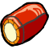
> > >
> > > {: .item-inner-callout }
> > > > *Energy Cannon*{: .fs-6 .header-font }  
> > > > *Gear*{: .label .gear .header-font }*Basic*{: .label .gear .header-font }*Weapon*{: .label .item .header-font }  
> > > >
> > > > An arm cannon that fires electrical shots.
> > > >
> > > > *Tool (Indirect) Tech Default*{: .mgl .fs-3 }
> > >
> > 
> > {: .specie-inner-callout .item-left }
> > > 
> > >
> > > {: .item-inner-callout }
> > > > *Healing Machine*{: .fs-6 .header-font }  
> > > > *Gear*{: .label .gear .header-font }*Basic*{: .label .gear .header-font }*Gadget*{: .label .item .header-font }  
> > > >
> > > > A small drone with healing capabilities.
> > > >
> > > > *Hearty Tech Default*{: .mgl .fs-3 }
> > >
> > 
>

---
{: .species-separator }

{: .specie-callout }
> ## Cream the Rabbit
>
> 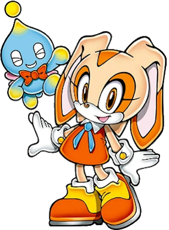
> {: .float-right-desktop }
>
> Character by *@meineeds.rest*{: .italic .courage-color }  
> [Google Sheets](https://docs.google.com/spreadsheets/d/1UwttDbr8rTMu_wHWyxkMUjpn9Lge8Y6EsLHOMS1wHE4/)
>
> {: .specie-inner-callout }
> > *HP: 5 / 5*{: .text-gamma .header-font .heart-color }  
> > *FP: 10 / 10*{: .text-gamma .header-font .spirit-color }  
> > *BP: 7 / 9*{: .text-gamma .header-font .courage-color }  
> > *SP: 10 / 10*{: .text-gamma .header-font .sp-color }  
> > *Level: 1*{: .text-gamma .header-font .level-color }  
>
> {: .specie-inner-callout }
> > *Heart: 1*{: .text-gamma .header-font .heart-color }  
> > *Spirit: 2*{: .text-gamma .header-font .spirit-color }  
> > *Courage: 3*{: .text-gamma .header-font .courage-color }  
> > *Power: 1*{: .text-gamma .header-font }  
> > *Defense: 0*{: .text-gamma .header-font }  
>
> *Mobian (Fly-Type)*{: .text-gamma .header-font }, Beige  
>
> {: .character-heart-callout }
> > *Aim: 0*{: .heart-color }  
> > *Athletics: 2 (+Fly)*{: .heart-color }  
> > *Coordination: 0*{: .heart-color }  
> > *Guard: 0*{: .heart-color }  
> > *Heal: 1 (+Pure Heart)*{: .heart-color }
>
> {: .character-spirit-callout }
> > *Crafts: 0*{: .spirit-color }  
> > *Knowhow: 0*{: .spirit-color }  
> > *Magic: 0*{: .spirit-color }  
> > *Notice: 2 (+Listen, +Lies)*{: .spirit-color }  
> > *Trickery: 0 (+Dodge)*{: .spirit-color }  
>
> {: .character-courage-callout }
> > *Bully: 0*{: .courage-color }  
> > *Cheer: 2 (+Summoning)*{: .courage-color }  
> > *Perform: 1*{: .courage-color }  
> > *Persuade: 0*{: .courage-color }  
> > *Steady: 1 (+VS Fear)*{: .courage-color }
>
> {: .specie-inner-callout }
> > Fly  
> > Carrier  
> > Hover  
> > Resilient  
> > *You can recover from KO with a **Nice**{: .nice-color } **Steady**{:courage-color } check, reviving back up to **5 HP**{: .heart-color }.*{: .mgl .fs-3 }  
> > *An extra Grade allows you to act immediately!*{: .mgl .fs-3 }  
> > *Required Grades incrase by 1 for each Resilient check made during an encounter.*{: .mgl .fs-3 }  
> > Weakness (Noise)  
> > *The Level and Duration of all Statuses you suffer from sound-based source is doubled.*{: .mgl .fs-3 }  
> > Weakness (Confuse, Provoke)  
> > *The Level and Duration of any of these Statuses inflicted on you is doubled.*{: .mgl .fs-3 }  
>
> {: .specie-inner-callout }
> > *Tech Defaults*{: .text-gamma .header-font }  
> >
> > Aerial  
> > *Ranged*{: .alt-grey-line }  
> > Minion  
> > *Secure (High Flying)*{: .alt-grey-line }  
>
> {: .specie-inverted-callout }
> > *Innate Techniques*{: .text-gamma .header-font .text-grey-lt-000 }  
> >
> > {: .specie-inner-callout }  
> > > *A-Are you okay?!*{: .header-font } (**0 FP**{: .spirit-color })  
> > > Prays for someone's well-being, reassuring herself in the process.  
> > > 
> > > *Heal (+Pure Heart)*{: .heart-color }:  
> > > *Good!*{: .good-color }: Heals **4 HP**{: .heart-color } to the Target and You.  
> > > *Great!*{: .great-color }: Heals **6 HP**{: .heart-color } to the Target and You.  
> > > *Hearty x3, Empower, Shared, Harmless, Others, Unwieldy*{: .italic .fs-3 }  
> > >
> >
> > {: .specie-inner-callout }  
> > > *Help me, Cheese!*{: .header-font } (**2 FP**{: .spirit-color })  
> > > Summons your trusted Cheese Chao (and sometimes even Chocolat!) as an ally to fight alongside you.  
> > > They stay up for 4 rounds, unless something happens to them..
> > > 
> > > *Cheer (+Summoning)*{: .courage-color }:  
> > > *Nice!*{: .nice-color }: Calls Cheese Chao to the field  
> > > *Good!*{: .good-color }: Calls Cheese and Chocolat Chao to the field  
> > > *Great!*{: .great-color }: Calls Super Cheese to the field; or both Cheese and Chocolat Chao  
> > >
> > > {: .specie-inverted-callout }
> > > > 
> > > > {: .specie-inner-callout }
> > > > > *Tier 1: Cheese Chao*{: .header-font } 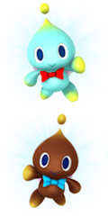{: .float-right-desktop }  
> > > > > *(Or Chocolat Chao)*{: .fs-3 }
> > > > >
> > > > > *5 HP*{: .heart-color }, 1 Power, 1 Defense  
> > > > > 
> > > > > *Chao Rush*{: .underlined }: The Chao rushes towards the enemy, and hits them with their tiny fists, at quick speed, dealing 4 DMG.  
> > > > > *(Strong)*{: .mgl .italic .fs-3 }  
> > > > > 
> > > > > Fly  
> > > > > Weakness (Air)  
> > > > > *+2 damage and becomes Disoriented (1) for turns equal to damage.*{: .mgl .fs-3 }
> > > > >
> > > > > *Budget usage (5/5 points):*{: .nice-color .fs-2 }  
> > > > > ***2 Points**{: .bold }: HP, **1 Point**{: .bold }: Power, **0 Points**{: .bold }: Defense, **2 Points**{: .bold }: Technique, **0 Points**{: .bold }: Traits*{: .mgl .fs-2 }
> > > >
> > > > {: .specie-inner-callout }
> > > > > *Tier 3: Super Cheese*{: .header-font } 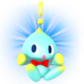{: .float-right-desktop }
> > > > >
> > > > > *9 HP*{: .heart-color }, 2 Power, 2 Defense  
> > > > > 
> > > > > *Dizzy Punch*{: .underlined }: Cheese winds up a wicked punch against whoever tries to harm Cream, unleashing it next turn, dealing 10 Piercing DMG and Dazing (2) the target for 2 turns.  
> > > > > *(Strong x3, Daze x2, Piercing, Delayed, Exhausting)*{: .mgl .italic .fs-3 }  
> > > > >
> > > > > Resilient  
> > > > > Fly  
> > > > > Weakness (Air)  
> > > > > *+2 damage and becomes Disoriented (1) for turns equal to damage.*{: .mgl .fs-3 }
> > > > >
> > > > > *Budget usage (15/15 points):*{: .great-color .fs-2 }  
> > > > > ***4 Points**{: .bold }: HP, **2 Points**{: .bold }: Power, **2 Points**{: .bold }: Defense, **5 Points**{: .bold }: Technique, **2 Points**{: .bold }: Traits*{: .mgl .fs-2 }
> > > >
> > > 
> > > *Minion x3, Lengthen, Harmless, Limitation (-2FP: No summon from this Technique already on the field)*{: .italic .fs-3 }
> > >
> >
>
> {: .specie-inverted-callout }
> > *Badges*{: .text-gamma .header-font .text-grey-lt-000 }
> >
> > {: .specie-inner-callout .item-left }
> > > 
> > >
> > > {: .item-inner-callout }
> > > > *Super Appeal*{: .fs-6 .header-font }  
> > > > *Badge*{: .label .item .header-font }*Skills*{: .label .skills-badge .header-font }  
> > > > {: .inline-icon } • 1 BP
> > > >
> > > > Adds +1d6 to *Appeal*{: .courage-color } checks.
> > >
> > 
> > {: .specie-inner-callout .item-left }
> > > 
> > >
> > > {: .item-inner-callout }
> > > > *Last Stand*{: .fs-6 .header-font }  
> > > > *Badge*{: .label .item .header-font }*Defense*{: .label .defense-badge .header-font }  
> > > > {: .inline-icon } • 1 BP
> > > >
> > > > When you have *5 or less HP*{: .heart-color }, incoming attacks deal 1/2 as much Raw Damage.
> > >
>

---
{: .species-separator }

{: .specie-callout }
> ## Metal Sonic
>
> 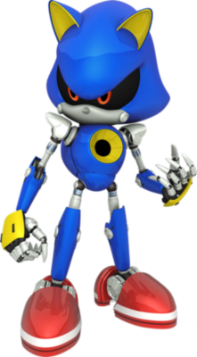
> {: .float-right-desktop }
>
> Character by *@lucydndprincess*{: .italic .courage-color }  
> [Google Sheets](https://docs.google.com/spreadsheets/d/1zYU_NJJYbP9LvsRwJUC0RVN4PrG3_VnZzIxGDY9YcmY/edit?usp=sharing)
>
> {: .specie-inner-callout }
> > *HP: 15 / 15*{: .text-gamma .header-font .heart-color }  
> > *FP: 0 / 0*{: .text-gamma .header-font .spirit-color }  
> > *BP: 4 / 6*{: .text-gamma .header-font .courage-color }  
> > *SP: 10 / 10*{: .text-gamma .header-font .sp-color }  
> > *Level: 1*{: .text-gamma .header-font .level-color }  
>
> {: .specie-inner-callout }
> > *Heart: 3*{: .text-gamma .header-font .heart-color }  
> > *Spirit: 0*{: .text-gamma .header-font .spirit-color }  
> > *Courage: 2*{: .text-gamma .header-font .courage-color }  
> > *Power: 1*{: .text-gamma .header-font }  
> > *Defense: 0*{: .text-gamma .header-font }  
>
> *Mobian (Speed-Type, Metal)*{: .text-gamma .header-font }, Blue  
>
> {: .character-heart-callout }
> > *Aim: 0*{: .heart-color }  
> > *Athletics: 2 (+Hover, +Fly)*{: .heart-color }  
> > *Coordination: 0*{: .heart-color }  
> > *Guard: 2 (+Melee)*{: .heart-color }  
> > *Heal: 0*{: .heart-color }
>
> {: .character-spirit-callout }
> > *Crafts: 0*{: .spirit-color }  
> > *Knowhow: 0*{: .spirit-color }  
> > *Magic: 0*{: .spirit-color }  
> > *Notice: 2 (+Details, +Tattling)*{: .spirit-color }  
> > *Trickery: 0*{: .spirit-color }  
>
> {: .character-courage-callout }
> > *Bully: 0*{: .courage-color }  
> > *Cheer: 0*{: .courage-color }  
> > *Perform: 0*{: .courage-color }  
> > *Persuade: 0*{: .courage-color }  
> > *Steady: 3 (+VS Fear, +Resilient)*{: .courage-color }
>
> {: .specie-inner-callout }
> > Immune (Fire, Water)  
> > *Your form softens, Weakening your Defense and Resist traits for a duration equal to the damage taken.*{: .mgl .fs-3 }  
> > *The Status Level begins at 1, and increases by 1 each time this is triggered, until the status is recovered from.*{: .mgl .fs-3 }  
> > *If your Defense and Resist traits are reduced to 0 by this status, treat this trait as Weakness (Fire, Water) for the duration instead.*{: .mgl .fs-3}  
> > Immune (Poison)  
> > +2 Resist (Air, Blast, Earth, Ice)  
> > Hover
> > Resilient  
> > Construct (Lifelike)  
> > Weakness (Confuse, Provoke)  
> > *The Level and Duration of any of these Statuses inflicted on you is doubled.*{: .mgl .fs-3 }  
> > Weakness (Shock)  
> > *You take on a Contact Trait, dealing Piercing Shock damage. The damage and duration are both equal to ½ the damage taken (minimum 1)*{: .mgl .fs-3 }  
> > Devotion (to Speed)  
> > *You cannot willingly use the Delayed Technique Traits in your Innate Techniques.*{: .mgl .fs-3 }  
> > Sinker
>
> {: .specie-inner-callout }
> > *Tech Defaults*{: .text-gamma .header-font }  
> >
> > Variant (*Athletics*{: .heart-color })  
> > *Boost (Defense) x2, Self*{: .alt-grey-line }  
> > Secure (Metal Form)  
> > *Hustle*{: .alt-grey-line }  
> > 
> > *Required*{: .underlined }: When Hustle is added as a Tech Default, add either Self or a single Split Slot (which can't contain Strikes). Only the user can be targeted with Hustle.
>
> {: .specie-inverted-callout }
> > *Innate Techniques*{: .text-gamma .header-font .text-grey-lt-000 }  
> >
> > {: .specie-inner-callout }  
> > > *Ramping Speeds*{: .header-font } (**0 FP**{: .spirit-color })  
> > > Slam into your target, then build up speed for your next attack.  
> > > *Athletics*{: .heart-color }:  
> > > *Good!*{: .good-color }: 2 DMG to the target  
> > > *Athletics*{: .heart-color }:  
> > > *Nice!*{: .nice-color }: Your are Hustled (1) for 1 turn.  
> > > *Variant (**Athletics**{: .heart-color }), Commitment (Primary), Unwieldy, Limitation (Can't use **Exceptional Techniques**{: .courage-color} to change this Technique)*{: .italic .fs-3 }  
> > > *+ Split Slot (Hustle, Self)*{: .mgl .italic .fs-3 }
> > >
> >
> > {: .specie-inner-callout }  
> > > *Black Shield*{: .header-font } (**0 FP**{: .spirit-color })  
> > > Protect yourself from all attacks.  
> > > *Guard*{: .heart-color }:  
> > > *Good!*{: .good-color }: You become Secured and Immune to Fire, Shock and Water for 1 Turn.  
> > > *Secure, Bestow x3, Harmless, Self, Unwieldy*{: .italic .fs-3 }
> > >
> >
>
> {: .specie-inverted-callout }
> > *Badges*{: .text-gamma .header-font .text-grey-lt-000 }
> >
> > {: .specie-inner-callout .item-left }
> > > 
> > >
> > > {: .item-inner-callout }
> > > > *Peekaboo*{: .fs-6 .header-font }  
> > > > *Badge*{: .label .item .header-font }*Skills*{: .label .skills-badge .header-font }  
> > > > {: .inline-icon } • 2 BP
> > > >
> > > > Once per turn, you can make a *Notice*{: .spirit-color } check as a free action.  
> > > > For each Grade of Success, you can choose one enemy and learn their current and max *HP*{: .heart-color }.
> > >
> > 
>

---
{: .species-separator }

{: .specie-callout }
> ## Mecha Sonic Mark II
>
> 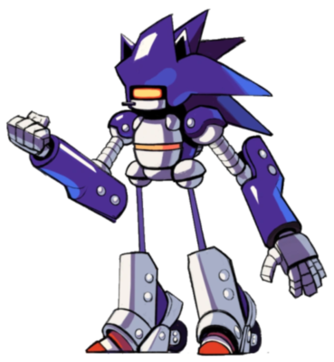
> {: .float-right-desktop }
>
> Character by *@lucydndprincess*{: .italic .courage-color }  
> [Google Sheets](https://docs.google.com/spreadsheets/d/1zYU_NJJYbP9LvsRwJUC0RVN4PrG3_VnZzIxGDY9YcmY/edit?usp=sharing)
>
> {: .specie-inner-callout }
> > *HP: 15 / 15*{: .text-gamma .header-font .heart-color }  
> > *FP: 5 / 5*{: .text-gamma .header-font .spirit-color }  
> > *BP: 0 / 0*{: .text-gamma .header-font .courage-color }  
> > *SP: 10 / 10*{: .text-gamma .header-font .sp-color }  
> > *Level: 1*{: .text-gamma .header-font .level-color }  
>
> {: .specie-inner-callout }
> > *Heart: 3*{: .text-gamma .header-font .heart-color }  
> > *Spirit: 1*{: .text-gamma .header-font .spirit-color }  
> > *Courage: 0*{: .text-gamma .header-font .courage-color }  
> > *Power: 3*{: .text-gamma .header-font }  
> > *Defense: 0*{: .text-gamma .header-font }  
>
> *Mobian (Power-Type, Mecha)*{: .text-gamma .header-font }, Blue  
>
> {: .character-heart-callout }
> > *Aim: 1 (+Guns)*{: .heart-color }  
> > *Athletics: 3 (+Brawn, +Jump)*{: .heart-color }  
> > *Coordination: 0*{: .heart-color }  
> > *Guard: 0*{: .heart-color }  
> > *Heal: 0*{: .heart-color }
>
> {: .character-spirit-callout }
> > *Crafts: 0*{: .spirit-color }  
> > *Knowhow: 0*{: .spirit-color }  
> > *Magic: 0*{: .spirit-color }  
> > *Notice: 2 (+Details, +Tattling)*{: .spirit-color }  
> > *Trickery: 0*{: .spirit-color }  
>
> {: .character-courage-callout }
> > *Bully: 0*{: .courage-color }  
> > *Cheer: 0*{: .courage-color }  
> > *Perform: 0*{: .courage-color }  
> > *Persuade: 0*{: .courage-color }  
> > *Steady: 3 (+VS Fear, +Resilient)*{: .courage-color }
>
> {: .specie-inner-callout }
> > Immune (Charm, Fear, Poison, Provoke, Sleep)  
> > +1 Resist (Air, Blast, Earth, Magic)  
> > Hover
> > Resilient  
> > Construct  
> > Weakness (Shock, Water)  
> > *You take +2 damage and become Confused (1) for a number of turns equal to the damage taken (minimum 1 turn).*{: .mgl .fs-3 }  
> > Sinker
>
> {: .specie-inner-callout }
> > *Tech Defaults*{: .text-gamma .header-font }  
> >
> > Aerial  
> > *Element (Blast)*{: .alt-grey-line }  
> > Element (Shock)  
> > *Tool (Built-In)*{: .alt-grey-line }  
> >
> > *Optional*{: .underlined }: Element (Blast) on Indirect or Ranged attacks,  
> > ***or**{: .underlined } Element (Shock) on attacks.*{: .mgl-big }
>
> {: .specie-inverted-callout }
> > *Innate Techniques*{: .text-gamma .header-font .text-grey-lt-000 }  
> >
> > {: .specie-inner-callout }  
> > > *Spin Jump*{: .header-font } (**0 FP**{: .spirit-color })  
> > > Curl into a spiky ball in the air and slam into a target of your choice.  
> > > *Athletics (+Jump)*{: .heart-color }:  
> > > *Nice!*{: .nice-color }: 6 DMG to the target  
> > > *Aerial, Indirect, Commitment*{: .italic .fs-3 }
> > >
> >
> > {: .specie-inner-callout }  
> > > *Shock Dash*{: .header-font } (**4 FP**{: .spirit-color })  
> > > Coat yourself in electricity, rev up your wheels, and slam through your opponents.  
> > > *Athletics*{: .heart-color }:  
> > > *Nice!*{: .nice-color }: 6 Shock Damage to all enemies at your elevation.  
> > > *Element (Shock), Variant (**Athletics**{: .heart-color }), Indirect, Overrun, Commitment*{: .italic .fs-3 }
> > >
> >
>

--- 
{: .species-separator }

{: .specie-callout }
> ## Dr Ivo "Eggman" Robotnik
>
> 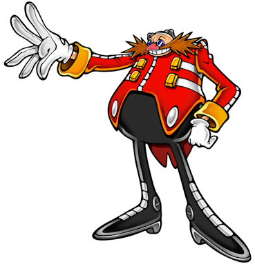
> {: .float-right-desktop }
>
> Character by *@plusdeuce*{: .italic .courage-color }  
> [Google Sheets](https://docs.google.com/spreadsheets/d/1T-Zax8PunEXmZbm-rTQBND8IlM7zxO7hG0DJtSEt4FI/)
>
> {: .specie-inner-callout }
> > *HP: 15 / 15*{: .text-gamma .header-font .heart-color }  
> > *FP: 15 / 15*{: .text-gamma .header-font .spirit-color }  
> > *BP: 0 / 0*{: .text-gamma .header-font .courage-color }  
> > *SP: 10 / 10*{: .text-gamma .header-font .sp-color }  
> > *Level: 1*{: .text-gamma .header-font .level-color }  
>
> {: .specie-inner-callout }
> > *Heart: 3*{: .text-gamma .header-font .heart-color }  
> > *Spirit: 3*{: .text-gamma .header-font .spirit-color }  
> > *Courage: 0*{: .text-gamma .header-font .courage-color }  
> > *Power: 2*{: .text-gamma .header-font }  
> > *Defense: 0*{: .text-gamma .header-font }  
>
> *Human (Bulky)*{: .text-gamma .header-font }, Red  
>
> {: .character-heart-callout }
> > *Aim: 0*{: .heart-color }  
> > *Athletics: 1 (+Brawn)*{: .heart-color }  
> > *Coordination: 1 (+Pilot)*{: .heart-color }  
> > *Guard: 1*{: .heart-color }  
> > *Heal: 0*{: .heart-color }
>
> {: .character-spirit-callout }
> > *Crafts: 2 (+Machinery)*{: .spirit-color }  
> > *Knowhow: 1 (+Machinery)*{: .spirit-color }  
> > *Magic: 0*{: .spirit-color }  
> > *Notice: 0 (+Traps)*{: .spirit-color }  
> > *Trickery: 1 (+Bluffs)*{: .spirit-color }  
>
> {: .character-courage-callout }
> > *Bully: 2 (+Shove)*{: .courage-color }  
> > *Cheer: 0*{: .courage-color }  
> > *Perform: 0*{: .courage-color }  
> > *Persuade: 0*{: .courage-color }  
> > *Steady: 0*{: .courage-color }
>
> {: .specie-inner-callout }
> > Carrier  
> > *Eggman can carry those scrawny fools around with ease!*{: .mgl .fs-3 }
>
> {: .specie-inner-callout }
> > *Tech Defaults*{: .text-gamma .header-font }  
> >
> > Bestow  
> > *Minion*{: .alt-grey-line }  
> > Throw  
> > *Tool*{: .alt-grey-line }  
> > 
> > *Required*{: .underlined }: Unwieldy (Primary) on attacks.
>
> {: .specie-inverted-callout }
> > *Innate Techniques*{: .text-gamma .header-font .text-grey-lt-000 }  
> >
> > {: .specie-inner-callout }  
> > > *Throw Down*{: .header-font } (**0 FP**{: .spirit-color })  
> > > Once he's back into a corner, Eggman opts to get his hands dirty.  
> > >
> > > Grabs and throws an enemy in melee into the closest other target, damaging them both.    
> > > 
> > > *Athletics (+Brawn)*{: .heart-color }:  
> > > *Nice!*{: .nice-color }: 2 DMG  
> > > *Good!*{: .good-color }: 4 DMG  
> > > *Throw, Unwieldy*{: .italic .fs-3 }  
> > >
> >
> > {: .specie-inner-callout }  
> > > *Badnik Barrage*{: .header-font } (**5 FP**{: .spirit-color })  
> > > Eggman's constantly working on his Badniks, and is ready to deploy them at a moment's notice.  
> > > A genius must be able to concentrate, though; deploying minions prevents Eggman from acting next turn.  
> > > 
> > > The Badniks don't attack on the turn they're deployed, and persist for 3 rounds afterwards – if they don't get scrapped first...    
> > > 
> > > *Crafts (+Machinery)*{: .spirit-color }:  
> > > *Nice!*{: .nice-color }: Deploys one Egg Pawn  
> > > *Good!*{: .good-color }: Deploys one Buzz Bomber; or Deploys two Egg Pawns  
> > > *Great!*{: .great-color }: Deploys one Crabmeat; or Deploys three Egg Pawns  
> > > *Wonderful!*{: .wonderful-color }: Deploys one Orbinaut; or Deploys two Buzz Bombers; or Deploys four Egg Pawns
> > >
> > > {: .specie-inverted-callout }
> > > > 
> > > > {: .specie-inner-callout }
> > > > > *Tier 1: Egg Pawn*{: .header-font } 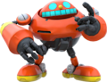{: .float-right-desktop }
> > > > >
> > > > > *3 HP*{: .heart-color }, 1 Power, 1 Defense  
> > > > > 
> > > > > Attacks in melee with an Egg Spear for 2 DMG; can reach airborne foes with ease.  
> > > > > *(Reach, Tool (Indirect))*{: .mgl .italic .fs-3 }  
> > > > > 
> > > > > Construct  
> > > > > Weakness (Shock)  
> > > > > *+2 damage and becomes Confused (1) for turns equal to damage.*{: .mgl .fs-3 }
> > > > >
> > > > > *Budget usage (5/5 points):*{: .nice-color .fs-2 }  
> > > > > ***1 Point**{: .bold }: HP, **1 Point**{: .bold }: Power, **1 Point**{: .bold }: Defense, **2 Points**{: .bold }: Technique, **0 Points**{: .bold }: Traits (Construct, Weakness)*{: .mgl .fs-2 }
> > > >
> > > > {: .specie-inner-callout }
> > > > > *Tier 2: Buzz Bomber*{: .header-font } 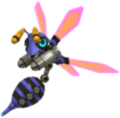{: .float-right-desktop }
> > > > >
> > > > > *5 HP*{: .heart-color }, 1 Power, 1 Defense  
> > > > > 
> > > > > Attacks from above with a ranged blast, dealing 6 DMG.  
> > > > > *(Strong x2, Ranged, Situational (Common: above Target))*{: .mgl .italic .fs-3 }  
> > > > >
> > > > > Fly  
> > > > > Construct  
> > > > > Weakness (Shock)  
> > > > > *+2 damage and becomes Confused (1) for turns equal to damage.*{: .mgl .fs-3 }
> > > > >
> > > > > *Budget usage (10/10 points):*{: .good-color .fs-2 }  
> > > > > ***2 Points**{: .bold }: HP, **1 Point**{: .bold }: Power, **1 Point**{: .bold }: Defense, **4 Points**{: .bold }: Technique, **2 Points**{: .bold }: Traits (Fly, Construct, Weakness)*{: .mgl .fs-2 }
> > > >
> > > > {: .specie-inner-callout }
> > > > > *Tier 3: Crabmeat*{: .header-font }  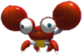{: .float-right-desktop }
> > > > >
> > > > > *7 HP*{: .heart-color }, 1 Power, 1 Defense  
> > > > >
> > > > > Scuttles up and fires two shots either side, dealing 4 DMG to two adjacent targets.  
> > > > > *(Ranged, Scaling, Strong, Split (2nd Strike), Limitation (-1FP: Adjacent targets only))*{: .mgl .italic .fs-3 }  
> > > > >
> > > > > Construct  
> > > > > 1 Resist (Water)  
> > > > > Adapted (Water)  
> > > > > Sinker  
> > > > > Weakness (Shock)  
> > > > > *+2 damage and becomes Confused (1) for turns equal to damage.*{: .mgl .fs-3 }
> > > > >
> > > > > *Budget usage (15/15 points):*{: .great-color .fs-2 }  
> > > > > ***3 Points**{: .bold }: HP, **1 Point**{: .bold }: Power, **1 Point**{: .bold }: Defense, **8 Points**{: .bold }: Technique, **2 Points**{: .bold }: Traits*{: .mgl .fs-2 }
> > > > 
> > > > {: .specie-inner-callout }
> > > > > *Tier 4: Orbinaut*{: .header-font } 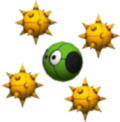{: .float-right-desktop }
> > > > >
> > > > > *7 HP*{: .heart-color }, 2 Power, 2 Defense  
> > > > > 
> > > > > Becomes Secure on its turn and prepares to counter melee attackers.  
> > > > > Deals 18 Piercing DMG to the next person to strike it in melee.  
> > > > > Can't act for a turn afterwards – giving their enemies an opening.  
> > > > > *(Counter (Secure), Piercing, Scaling, Strong x4, Exhausting, Self)*{: .mgl .italic .fs-3 }  
> > > > > 
> > > > > Hover  
> > > > > Construct  
> > > > > 1 Resist (Blast)  
> > > > > Sinker  
> > > > > Weakness (Shock)  
> > > > > *+2 damage and becomes Confused (1) for turns equal to damage.*{: .mgl .fs-3 }
> > > > >
> > > > > *Budget usage (20/20 points):*{: .wonderful-color .fs-2 }  
> > > > > ***3 Point**{: .bold }: HP, **2 Points**{: .bold }: Power, **2 Points**{: .bold }: Defense, **11 Points**{: .bold }: Technique, **2 Points**{: .bold }: Traits*{: .mgl .fs-2 }
> > > >
> > > 
> > > *Minion x4, Variant (**Crafts**{: .spirit-color }), Exhausting, Harmless, Shorten*{: .italic .fs-3 }
> > >
> >
>
> {: .specie-inverted-callout }
> > *Gear Techniques*{: .text-gamma .header-font .text-grey-lt-000 }  
> >
> > {: .specie-inner-callout }  
> > > *Egg Wrecker*{: .header-font } (**0 FP**{: .spirit-color })  
> > > *From Egg Mobile Mk1*{: .mgl .fs-3 }  
> > >
> > > Swings a hefty wrecking ball from the base of the Egg Mobile!  
> > >
> > > *Coordination (+Pilot)*{: .heart-color }:  
> > > *Nice!*{: .nice-color }: 3 DMG  
> > > *Good!*{: .good-color }: 6 DMG  
> > > *Tool (Indirect), Strong, Unwieldy*{: .italic .fs-3 }  
> > >
> >
> 
> {: .specie-inverted-callout }
> > *Inventory*{: .text-gamma .header-font .text-grey-lt-000 }
> >
> > {: .specie-inner-callout .item-left }
> > > 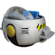
> > >
> > > {: .item-inner-callout }
> > > > *Egg Mobile Mk1*{: .fs-6 .header-font }  
> > > > *Gear*{: .label .gear .header-font }*Basic*{: .label .gear .header-font }*Mech*{: .label .item .header-font }  
> > > >
> > > > The flagship of the Eggman Empire!  
> > > > Provides Fly and Hover while piloted, as well as access to the *Egg Wrecker*{: .bold } Technique.  
> > > > Despite its superior engineering, checks made to Fly can't score more than a *Nice*{: .nice-color } result.
> > > > 
> > > > Also, it only has room for one in the cockpit. And no cup holder attachment? This won't do...
> > > > 
> > > > *Tool (Indirect) Tech Default, Fly, Hover*{: .mgl .fs-3 }
> > >
> > 
>

# On Star Power

Star Power isn't necessarily applicable for a game taking place in Sonic's World, but there's an easy way to reflavour it!

The Star Element can simply become the *Chaos Element*{: .courage-color }, representing power similar to that of the Chaos Emeralds, or even the Emeralds themselves.

*Star Power (SP)*{: .courage-color } itself can easily be reflavored as *Emerald Power (EP)*{: .courage-color }.  
Every ability that would normally ask or fill Star Power can simply be changed to Emerald Power. It simply represents the inherent potential of every creature to manipulate Chaos Energy, even without the use of actual Chaos Emeralds, although they can certainly be used to reinforce the max Emerald Power of the group.

## Emerald Power specific abilities

// Something about using the Chaos Emeralds to do cool stuff, maybe even Super Forms in some way.

# Inventory

// New Items, Badges, Gear, etc. 

## Items

// New Items

## Badges

// New Badges

(A Badge themed around the Spin Dash)  
(A Badge themed around tanking with money, akin to losing Rings)  
(A Badge encouraging Team attacks, maybe specifically with a Balanced Team of Speed-Type-, Power-Type- and Fly-Type- characters?)  
(A Badge giving bonuses when being Carried, or for using a Carried character as a projectile for a Ranged Attack, like the Fly-Type- attacks in Sonic Heroes?)  
(A Badge constantly powering you up with Emerald Power, forbidding you from sharing EP (in both ways), with big consequences if you can't pay the price at the beginning of the turn)