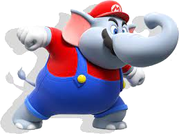
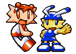
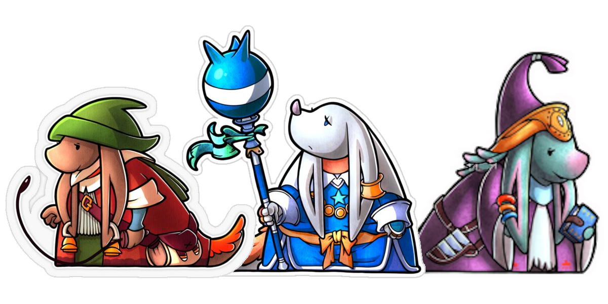
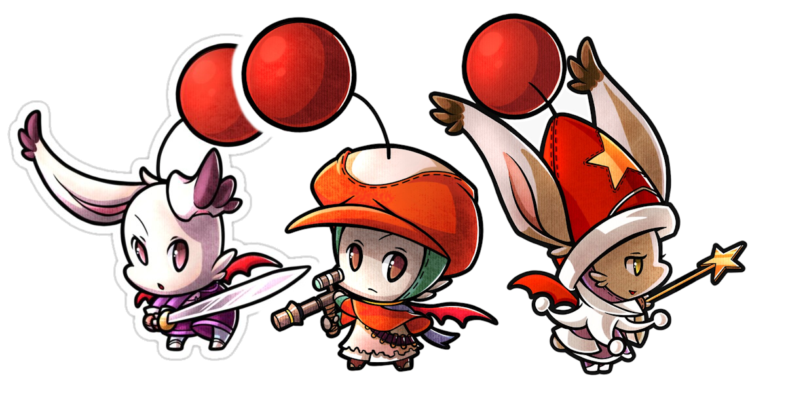
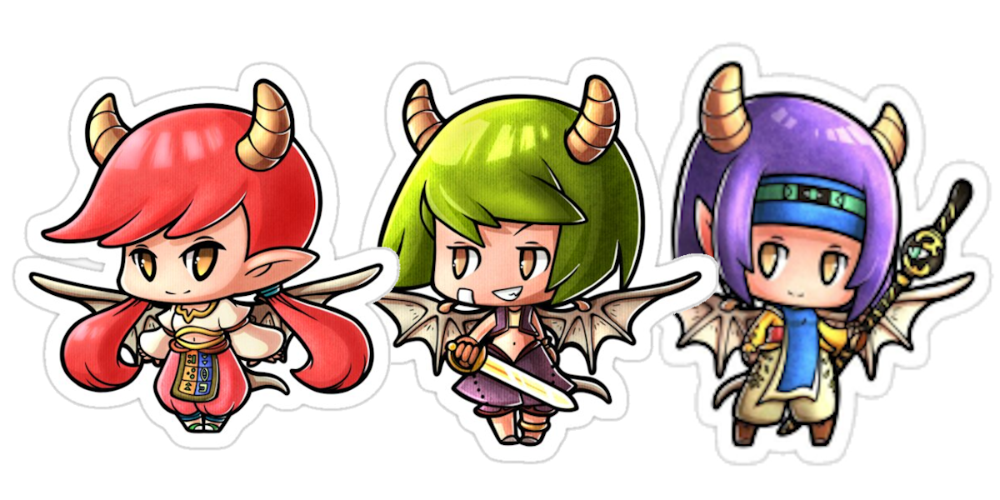
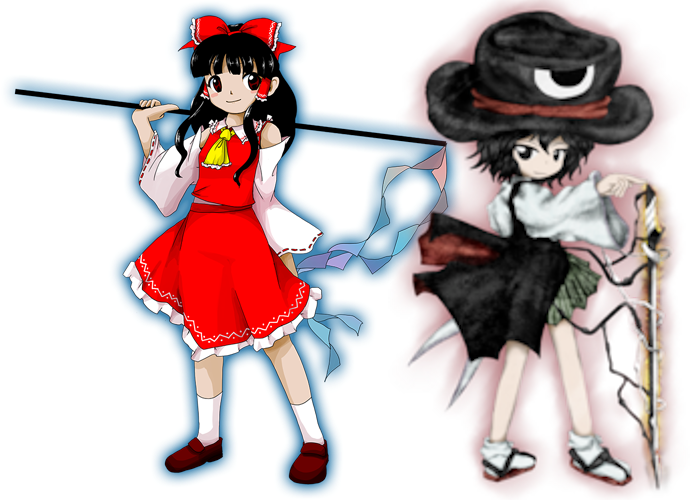
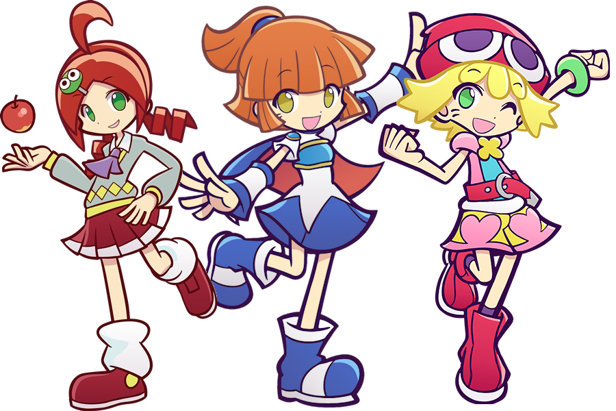

# Elive's Assorted Species
{: .no_toc }

  

    Table of contents
  

  {: .text-delta }
- TOC
{:toc}

# Species

{: .specie-callout }
> ## Pokio
>
> 
> {: .float-right-desktop }
> Small, pheasant-like avians notable for their tough, retractable beaks.  
> With pride and honor, these borbs (Bird-orbs) typically "fling" themselves head-first into their troubles, prodding at it before "poking" through with their natural solution.
>
> ***+1 Heart**{: .heart-color}, **+1 Courage**{: .courage-color}*{: .text-gamma .header-font }  
> *1 Power, 0 Defense*{: .text-gamma .header-font }  
>
> {: .specie-pros-callout }
> > *Pros*{: .text-gamma .header-font }  
> > *+ Coordination (Extend-o-Beak)*{: .heart-color }  
> > *or **+ Athletics (Nailing)**{: .heart-color }*{: .mgl }  
> > *+ Guard (Ranged)*{: .heart-color }  
> > *+ Steady (Stand-Ground)*{: .courage-color }  
>
> {: .specie-cons-callout }
> > *Cons*{: .text-gamma .header-font }  
> > N/A
>
> {: .specie-inner-callout }
> > *Tech Defaults*{: .text-gamma .header-font }  
> >
> > Reach  
> > *Strike-Through x2*{: .alt-grey-line }  
> > Counter  
> > *Piercing*{: .alt-grey-line }  
> >
> > *Optional*{: .underlined }: Indirect on Reach and Strike-Through Techniques.
>

{: .specie-callout }
> ## Elephant-Kin
>
> 
> {: .float-right-desktop }
> Bipedal creatures with good hearing, strong hides and even stronger trunks, the latter making them capable of acrobatic maneuvers and blasting air and water.  
> They're generally quite approachable, but their sensitive ears make them easy to startle.
>
> ***+2 Heart**{: .heart-color } or **+1 Heart**{: .heart-color }, **+1 Courage**{: .courage-color }*{: .text-gamma .header-font }  
> *1 Power, 1 Defense*{: .text-gamma .header-font }  
>
> {: .specie-pros-callout }
> > *Pros*{: .text-gamma .header-font }  
> > *+ Athletics (Trunks)*{: .heart-color }  
> > *+ Notice (Sounds)*{: .spirit-color }  
> > *+ Athletics (Brawn)*{: .heart-color }  
> > *or **+ Perform (Trumpetting)**{: .courage-color }*{: .mgl }  
>
> {: .specie-cons-callout }
> > *Cons*{: .text-gamma .header-font }  
> > Weakness (Sounds)  
> > *Damage dealt by sound-based sources is doubled.*{: .mgl .fs-3 }  
> > *The Level and Duration of negative statuses inflicted by sound-based sources are increased by 1.*{: .mgl .fs-3 }  
> > Weakness (Provoke, Confuse)  
> > *The Level and Duration of any of these Statuses inflicted on you is doubled.*{: .mgl .fs-3 }  
>
> {: .specie-inner-callout }
> > *Tech Defaults*{: .text-gamma .header-font }  
> >
> > Throw  
> > *Indirect, Reach*{: .alt-grey-line }  
> > Ranged, Variant (*Athletics*{: .heart-color })  
> > *Quake*{: .alt-grey-line }  
> >
> > *Optional*{: .underlined }: Element (Water) or Element (Air) on Ranged Attacks.
>

{: .specie-callout }
> ## Kitchen-Kids (Tomato Adventure)
>
> 
> {: .float-right-desktop }
> Hailing from a variety of culinary-themed kingdoms, these youngsters of differing looks and sizes share a love and affinity for gimmick-ridden gadgets and challenges.  
> Because of this, you can count on them to get the job done together (No matter how unorthodox their methods appear).
>
> ***+1 Courage**{: .courage-color }, +1 Any Stat*{: .text-gamma .header-font }  
> *1 Power, 0 Defense*{: .text-gamma .header-font }  
>
> {: .specie-pros-callout }
> > *Pros*{: .text-gamma .header-font }  
> > *+ Coordination (Toys)*{: .heart-color }  
> > *+ Athletics (Minigames)*{: .heart-color }  
> > *or **+ Craft (Gizmos)**{: .spirit-color }*{: .mgl }  
> > *+ Cheer (Teamwork)*{: .courage-color }  
>
> {: .specie-cons-callout }
> > *Cons*{: .text-gamma .header-font }  
> > N/A
>
> {: .specie-inner-callout }
> > *Tech Defaults*{: .text-gamma .header-font }  
> >
> > Tool  
> > *Flowery*{: .alt-grey-line }  
> > Alt-Cost (*SP*{: .courage-color})    
> > *Overclock [[Elive]]()*{: .alt-grey-line }  
> >
> > *Optional*{: .underlined }: Split on Flowery Techniques.
>

{: .specie-callout }
> ## Chocobo
>
> 
> {: .float-right-desktop }
> Birds of many feathers and many capabilities, but commonly flightless with a fast-dash.  
> Outside of their speed when healthy, many seek a Chocobo companion for their gentle natures, yet undeniable bravery (Not to mention their cuteness).
>
> ***+1 Heart**{: .heart-color }, **+1 Courage**{: .courage-color }*{: .text-gamma .header-font }  
> *1 Power, 0 Defense*{: .text-gamma .header-font }  
>
> {: .specie-pros-callout }
> > *Pros*{: .text-gamma .header-font }  
> > *+ Athletics (Run)*{: .heart-color }  
> > *or **+ Athletics (Beak)**{: .heart-color }*{: .mgl }  
> > *+ Coordination (Carrying)*{: .heart-color }  
> > *+ Cheer (Charge-up)*{: .courage-color }  
> > Carrier  
> > Immune (Fear)
>
> {: .specie-cons-callout }
> > *Cons*{: .text-gamma .header-font }  
> > Weakness (Fire)  
> > *You take +2 damage and suffer from a Lingering burn, lasting a number of turns equal to the damage taken.*{: .mgl .fs-3 }
>
> {: .specie-inner-callout }
> > *Tech Defaults*{: .text-gamma .header-font }  
> >
> > Overrun  
> > *Confuse x2*{: .alt-grey-line }  
> > Strong  
> > *Aerial*{: .alt-grey-line }  
>

{: .specie-callout }
> ## Nu-Mou
>
> {: .center-img }
>
> With elongated faces and drooping, bored ears, this old-looking race is one of many hailing from the land of Ivalice.  
> Though ill-fit for the front lines, their expertise in medicine, ancient stories and all things magic make up for it tenfold.
>
> *+2 Spirit*{: .text-gamma .header-font .spirit-color }  
> *1 Power, 0 Defense*{: .text-gamma .header-font }  
>
> {: .specie-pros-callout }
> > *Pros*{: .text-gamma .header-font }  
> > *+ Heal (Alchemy)*{: .heart-color }  
> > *+ Knowhow (Lore)*{: .spirit-color }  
> > *+ Magic (Spontaneous Spells)*{: .spirit-color }  
> > 1 Resist (Magic)
> > 
>
> {: .specie-cons-callout }
> > *Cons*{: .text-gamma .header-font }  
> > Sinker
>
> {: .specie-inner-callout }
> > *Tech Defaults*{: .text-gamma .header-font }  
> >
> > Hearty x2  
> > *Minion*{: .alt-grey-line }  
> > Burst  
> >
> > 1x Custom Set of Traits  
> > Custom Sets are defined during character creation. For Nu-Mous, they can include any Traits totalling no more than *2 FP*{: .spirit-color }, but can't include negative Traits. They can include Variant (*Magic*{: .spirit-color }) or Variant (*Knowhow*{: .spirit-color }) for no additional cost.
> >
> > *Optional*{: .underlined }: Split on Hearty Techniques.
>

{: .specie-callout }
> ## Seeq
>
> {: .center-img }
>
> One-horned pig-people from the land of Ivalice, acting as excellent front-liners.  
> Though characterized as all brawn and no brains, many carry expertise in war tactics and unconventional item-use that can turn the tides of even the most one-sided of battles.
>
> *+2 Heart*{: .text-gamma .header-font .heart-color }  
> *2 Power, 0 Defense*{: .text-gamma .header-font }  
>
> {: .specie-pros-callout }
> > *Pros*{: .text-gamma .header-font }  
> > *+ Aim (Items)*{: .heart-color }  
> > *+ Athletics (Brute-Force)*{: .heart-color }  
> > *+ Cheer (Tactics)*{: .courage-color }  
>
> {: .specie-cons-callout }
> > *Cons*{: .text-gamma .header-font }  
> > Weakness (Charm, Provoke, Confuse)  
> > *The Level and Duration of any of these Statuses inflicted on you is doubled.*{: .mgl .fs-3 }
>
> {: .specie-inner-callout }
> > *Tech Defaults*{: .text-gamma .header-font }  
> >
> > Strong x2, Unwieldy  
> > *Disarm x2*{: .alt-grey-line }  
> > Boost  
> >
> > 1x Custom Set of Traits  
> > Custom Sets are defined during character creation. For Seeqs, they can include any Traits totalling no more than *2 FP*{: .spirit-color }, but can't include negative Traits. They can include Variant (*Athletics*{: .heart-color }) for no additional cost.
> >
> > *Optional*{: .underlined }: Variant (*Athletics*{: .heart-color }) on damaging Techniques.
>

{: .specie-callout }
> ### Moogle
>
> {: .center-img }
>
> Short-stature, cute bat-wings, and bright red pom-poms easily distinguish these daring folk from the rest of the Ivalian crowd.  
> They're well known for their verbal tic “Kupo”, and the variety of odd-jobs they can find themselves in, so long as they set their minds to them.
>
> *+2 Courage*{: .text-gamma .header-font .courage-color }  
> *1 Power, 0 Defense*{: .text-gamma .header-font }  
>
> {: .specie-pros-callout }
> > *Pros*{: .text-gamma .header-font }  
> > *+ Crafts (Machinery)*{: .spirit-color }  
> > *+ Persuade (Charm)*{: .courage-color }  
> > *+ Perform (Charm)*{: .courage-color }  
> > Hover
>
> {: .specie-cons-callout }
> > *Cons*{: .text-gamma .header-font }  
> > Sinker  
>
> {: .specie-inner-callout }
> > *Tech Defaults*{: .text-gamma .header-font }  
> >
> > Tool  
> > *Charm x2*{: .alt-grey-line }  
> >
> > 1x Custom Set of Traits  
> > Custom Sets are defined during character creation. For Moogles, they can include any Traits totalling no more than *2 FP*{: .spirit-color }, but can't include negative Traits. They can include Tool for no additional cost.
>

{: .specie-callout }
> ## Viera
>
> {: .center-img }
>
> Silver-haired are these hare-featured folk from the woods of Ivalice.  
> Limber, keen to even the slightest change in their surroundings, and deeply entwined with the voice of the woods, they're able to avoid even the most chaotic of attack flurries, make precise strikes, and call upon spiritual energy to aid them.
>
> ***+1 Heart**{: .heart-color }, **+1 Spirit**{: .spirit-color }*{: .text-gamma .header-font }  
> *1 Power, 0 Defense*{: .text-gamma .header-font }  
>
> {: .specie-pros-callout }
> > *Pros*{: .text-gamma .header-font }  
> > *+ Aim (Bows)*{: .heart-color }  
> > *+ Trickery (Evasion)*{: .spirit-color }  
> > *+ Magic (Spirits)*{: .spirit-color }  
>
> {: .specie-cons-callout }
> > *Cons*{: .text-gamma .header-font }  
> > N/A
>
> {: .specie-inner-callout }
> > *Tech Defaults*{: .text-gamma .header-font }  
> >
> > Homing  
> > *Tool (Ranged)*{: .alt-grey-line }  
> > Secure (Reflexes)  
> >
> > 1x Custom Set of Traits  
> > Custom Sets are defined during character creation. For Vieras, they can include any Traits totalling no more than *2 FP*{: .spirit-color }, but can't include negative Traits.
> >
> > *Optional*{: .underlined }: Variant (*Trickery*{: .spirit-color }) on Tool Techniques.
>

{: .specie-callout }
> ## Bangaa
>
> {: .center-img }
>
> Reptilian-people from Ivalice with tough scales and intimidating looks.  
> They're characterized with a love for combat and proficiency with many forms of steel and edge, and are capable of fending off even the most unstoppable of forces.
>
> ***+1 Heart**{: .heart-color }, **+1 Courage**{: .courage-color }*{: .text-gamma .header-font }  
> *1 Power, 1 Defense*{: .text-gamma .header-font }  
>
> {: .specie-pros-callout }
> > *Pros*{: .text-gamma .header-font }  
> > *+ Coordination (Weaponry)*{: .heart-color }  
> > *+ Guard (Counter)*{: .heart-color }  
> > *+ Bully (Intimidation)*{: .courage-color }  
>
> {: .specie-cons-callout }
> > *Cons*{: .text-gamma .header-font }  
> > Weakness (Water)  
> > *You take +2 damage and your Defense is Weakened (1) for a number of turns equal to the damage taken.*{: .mgl .fs-3 }
>
> {: .specie-inner-callout }
> > *Tech Defaults*{: .text-gamma .header-font }  
> >
> > Piercing  
> > *Tool (Indirect)*{: .alt-grey-line }  
> > Counter  
> >
> > 1x Custom Set of Traits  
> > Custom Sets are defined during character creation. For Bangaas, they can include any Traits totalling no more than *2 FP*{: .spirit-color }, but can't include negative Traits.
> >
> > *Optional*{: .underlined }: Variant (*Guard*{: .heart-color }) on Indirect Techniques.
>

{: .specie-callout }
> ## Gria
>
> {: .center-img }
>
> Dragon-human hybrids, from the land of Ivalice, who are much tougher than they look.  
> Possessing powerful wings and a strong fighting spirit, they can rise above their competition, before swooping in for the kill.
>
> ***+1 Heart**{: .heart-color }, **+1 Courage**{: .courage-color }*{: .text-gamma .header-font }  
> *1 Power, 0 Defense*{: .text-gamma .header-font }  
>
> {: .specie-pros-callout }
> > *Pros*{: .text-gamma .header-font }  
> > *+ Athletics (Wings)*{: .heart-color }  
> > *+ Magic (Terrain)*{: .spirit-color }  
> > *+ Steady (Airborne)*{: .courage-color }  
> > Fly
>
> {: .specie-cons-callout }
> > *Cons*{: .text-gamma .header-font }  
> > Weakness (Air)  
> > *You take +2 damage and your Defense is Weakened (1) for a number of turns equal to the damage taken.*{: .mgl .fs-3 }
>
> {: .specie-inner-callout }
> > *Tech Defaults*{: .text-gamma .header-font }  
> >
> > Aerial  
> > *Terrain*{: .alt-grey-line }  
> > Weaken  
> >
> > 1x Custom Set of Traits  
> > Custom Sets are defined during character creation. For Grias, they can include any Traits totalling no more than *2 FP*{: .spirit-color }, but can't include negative Traits. They can include Variant (*Athletics*{: .heart-color }) for no additional cost.
>

# Subspecies

{: .subspecie-callout }
> ## Fruity-
>
> 
> {: .float-right-desktop }
>
> Creatures of this variety have a physique heavily entwined with fruits, be it having bodies that produce naturally sweet substances, or having ones that full-on mimic one and its properties.  
> Regardless of the specifics, they are said to be very approachable, for better (New friends) or worse (Potential predators).
>
> *e.g. Orange Pokeys, Magic-Paintbrush Yoshis*{: .italic }
>
> ***+1 Heart**{: .heart-color }, **-1 Spirit**{: .spirit-color }*{: .text-gamma .header-font }  
>
> {: .specie-inner-callout }
> > *Add*{: .text-gamma .header-font }  
> >
> > *+ Heal (Fruit)*{: .heart-color }  
> > *+ Cheer (FP)*{: .courage-color }  
> > *+ Persuade (Sweet-Scent)*{: .courage-color }  
> > +½ Fruit item effectiveness (As user or target)
> >
> > Weakness (Fire)  
> > *You take +2 damage and suffer from a Lingering burn, lasting a number of turns equal to the damage taken.*{: .mgl .fs-3 }
> > 
>
> {: .specie-inner-callout }
> > *Remove*{: .text-gamma .header-font }  
> > Specializations in *Athletics*{: .heart-color }, *Trickery*{: .spirit-color }, *Steady*{: .courage-color }; Remove any remaining specializations from the final species until you have at most 3.
> > 
>
> {: .specie-inner-callout }
> > *Added Tech Defaults*{: .text-gamma .header-font }  
> >
> > Hearty x2  
> > ***Optional**{: .underlined }: Split on Hearty Techniques.*{: .mgl .fs-3 }  
> > *Flowery*{: .alt-grey-line }    
> > ***Optional**{: .underlined }: Split on Flowery Techniques.*{: .mgl .fs-3 }  
> > Charm  
> > *Ranged*{: .alt-grey-line }  
>
> {: .specie-inner-callout }
> > *Removed Tech Defaults*{: .text-gamma .header-font }  
> >
> > Fear  
> > *Secure*{: .alt-grey-line }    
> > Divider  
> >
>
> {: .specie-inner-callout }
> > *Conditions*{: .text-gamma .header-font }  
> >
> > N/A
> >
>

{: .subspecie-callout }
> ## Gooey-
>
> 
> {: .float-right-desktop }
>
> These creatures have bodies of slime, sticky or loose on a whim, and while they aren't inherently toxic, they fare better than most in messy environments (Mud, goop and rain).  
> They can be picky at times with how their food is prepared though, which is understandable as a literal matter of life or death.
>
> *e.g. Snail Koopas(?), Spike Blops*{: .italic }
>
> ***+1 Courage**{: .courage-color }, **-1 Heart**{: .heart-color }*{: .text-gamma .header-font }  
>
> {: .specie-inner-callout }
> > *Add*{: .text-gamma .header-font }  
> >
> > *+ Athletics (Slip-Away)*{: .heart-color }  
> > *or **+ Trickery (Squeeze-Through)**{: .spirit-color }*{: .mgl }
> > *+ Bully (Sliming)*{: .courage-color }  
> > *+ Steady (Run-off)*{: .courage-color }  
> > Immune (Poison)  
> > *Recover **5 HP** instead.*{: .mgl .fs-3 }  
> > 1 Resist (Water)  
> > *You can easily keep your footing in rain, and recover **1 HP**{: .heart-color } when in rain or water every other turn.*{: .mgl .fs-3 }
> >
> > Weakness (Fire)  
> > *You take +2 damage and become Dazed (2), lasting a number of turns equal to the damage taken.*{: .mgl .fs-3 }  
> > Weakness (Salt)  
> > *You are Stunned (6) for 3 turns. During this period, any attacks targeting you ignore your defenses (Immunities and Weaknesses included) and deal +2 damage.*{: .mgl .fs-3 }
>
> {: .specie-inner-callout }
> > *Remove*{: .text-gamma .header-font }  
> > Specializations in *Athletics*{: .heart-color }, *Trickery*{: .spirit-color }, *Persuade*{: .courage-color }; Remove any remaining specializations from the final species until you have at most 3.
> > 
> > Weakness (Water)  
> > Weakness (Poison)  
> > Resist (Fire)
>
> {: .specie-inner-callout }
> > *Added Tech Defaults*{: .text-gamma .header-font }  
> >
> > Daze x2  
> > *Weaken (Dodge)*{: .alt-grey-line }  
> > Terrain (Goop)  
> > *Drain x2*{: .alt-grey-line }  
>
> {: .specie-inner-callout }
> > *Removed Tech Defaults*{: .text-gamma .header-font }  
> >
> > Homing  
> > *Dismiss*{: .alt-grey-line }  
> > Aerial  
> >
>
> {: .specie-inner-callout }
> > *Conditions*{: .text-gamma .header-font }  
> >
> > N/A
> >
>

{: .subspecie-callout }
> ## Bullet Artist (Touhou, Len'en, etc.)
>
> {: .center-img }
>
> Be it human, monster, or even god, these individuals are ones who see soaring through the air and creating waves of colorful yet powerful bullet curtains as the norm.  
> Though the specifics may vary, they'll almost always be up for giving you a beautiful (yet painful) showcase.
>
> *[Class Archetype]*{: .header-font }
>
> ***+1 Spirit**{: .spirit-color } or **+1 Courage**{: .courage-color }, **-1 Heart**{: .heart-color }*{: .text-gamma .header-font }
>
> {: .specie-inner-callout }
> > *Add*{: .text-gamma .header-font }  
> >
> > *+ Athletics (Flight)*{: .heart-color }  
> > *+ Crafts (Spell Cards)*{: .spirit-color }  
> > *or **+ Magic (Spell Cards)**{: .spirit-color }*{: .mgl }
> > *+ Perform (Grazing)*{: .courage-color }  
> > Fly  
> > Efficient (Bullet-Barrages)  
> >
> > Once per Battle, when hit with an Attack that would K.O. you, make a *Magic*{: .spirit-color } or *Perform*{: .courage-color } check:
> > ***Great!**{: .great-color }: Negate the Attack, and use a technique as a free action. The technique's cost is considered doubled for this use, and must cost more than **0 FP**{: .spirit-color } (and must be payable), but can also be an **MP**{: .mp-color }-costing technique from a spell card [[Elive]]() in your inventory (The spell card is used up for this, but is not triggered fully). If neither apply, the attack still goes through.*{: .mgl .fs-3 }
> >
> > Weakness (Air, Aerial)  
> > *You must make a **Steady**{: .courage-color } check versus Disorientation (1), lasting a number of turns equal to the damage taken (minimum 1 turn).*{: .mgl .fs-3 }  
>
> {: .specie-inner-callout }
> > *Remove*{: .text-gamma .header-font }  
> > Specializations in *Athletics*{: .heart-color }, *Guard*{: .heart-color }, *Persuade*{: .courage-color }; Remove any remaining specializations from the final species until you have at most 3.
> > 
> > Hover  
> > Resistance (Air, Aerial)  
> > Immune (Air, Aerial)
>
> {: .specie-inner-callout }
> > *Added Tech Defaults*{: .text-gamma .header-font }  
> >
> > All  
> > *Kit [[Elive]]()*{: .alt-grey-line }  
> > Ranged  
> > ***Optional**{: .underlined }: Variant (**Perform**{: .courage-color }) or Variant (**Magic**{: .spirit-color }) on Ranged attacks.*{: .mgl .fs-3 }  
> > *Minion*{: .alt-grey-line }  
>
> {: .specie-inner-callout }
> > *Removed Tech Defaults*{: .text-gamma .header-font }  
> >
> > Flowery  
> > *Secure*{: .alt-grey-line }  
> > Underfoot  
> >
>
> {: .specie-inner-callout }
> > *Conditions*{: .text-gamma .header-font }  
> >
> > N/A
> >
>

{: .subspecie-callout }
> ## Hue Sorcerer (Puyo Puyo)
>
> {: .center-img }
>
> Magic-users of a special archetype that are quite competitive.  
> Through a process typically reserved for mono-colored jelly creatures, these magicians can line up and extract magical power from entities of the same color to charge devastating attacks on opponents.
>
> *[Class Archetype]*{: .header-font }
>
> ***+1 Spirit**{: .spirit-color }, **-1 Heart**{: .heart-color }*{: .text-gamma .header-font }
>
> {: .specie-inner-callout }
> > *Add*{: .text-gamma .header-font }  
> >
> > *+ Magic (Colors)*{: .spirit-color }  
> > *+ Knowhow (Puzzles)*{: .spirit-color }  
> > *+ Bully (Daze)*{: .courage-color }  
> > Efficient (Swapping)  
> >
> > When targeting at least 3 adjacent enemies of the same prominent color (eg. Red shelled koopa, red cheep-cheep, cherry bob-omb), you roll 1 extra die for the checks + 1d6 for every extra applicable enemy beyond the minimum 3.
> >
> > Weakness (Multi-Hit)  
> > *Subsequent Attacks from a single enemy in a single turn deal +2 damage if the damage from the previous attack wasn't completely blocked.*{: .mgl .fs-3 }  
>
> {: .specie-inner-callout }
> > *Remove*{: .text-gamma .header-font }  
> > Specializations in *Athletics*{: .heart-color }, *Guard*{: .heart-color }, *Steady*{: .courage-color }; Remove any remaining specializations from the final species until you have at most 3.
> > 
>
> {: .specie-inner-callout }
> > *Added Tech Defaults*{: .text-gamma .header-font }  
> >
> > Element (Colors)  
> > ***Optional**{: .underlined }: Element (Colors) on Ranged or Indirect Techniques.*{: .mgl .fs-3 }  
> > *Swap*{: .alt-grey-line }  
> > Daze x2  
> > *Burst*{: .alt-grey-line }  
>
> {: .specie-inner-callout }
> > *Removed Tech Defaults*{: .text-gamma .header-font }  
> >
> > Hearty  
> > *Flowery*{: .alt-grey-line }    
> > Underfoot  
> > *Dismiss*{: .alt-grey-line }  
> >
>
> {: .specie-inner-callout }
> > *Conditions*{: .text-gamma .header-font }  
> >
> > N/A
> >
>