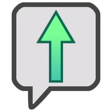

# Charged
{: .no_toc }

{: .content-callout }
> 
> {: .float-right }
> ## Charged
> 
> Your Attack is Charged, increasing it by the Status Level for the Duration of this Status.  
>
> Unlike other Statuses, Charged doesn't have a Turn duration, instead, any Levels of Charge you have end when you use a Technique that targets your enemies, even if no Damage was dealt.
> When gaining multiple instances of Charge, instead of keeping the higher Level, they add together.
